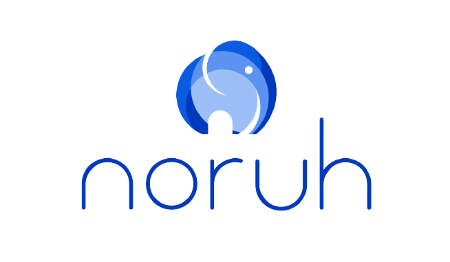

# Noruh - Requisitos de Software

## 1. Sobre o projeto

&emsp;&emsp;Este repositório é reservado à disciplina de Requisitos de software, dirigida pelo professor Andre Barros de Sales, do curso de engenharia de software do campus UnB-Gama. O aplicativo escolhido para ser analisado pelo nosso grupo 5, foi o "Noruh", onde o analisaremos, usando os conceitos estudados durante o semestre na disciplina, como a engenharia de requisitos, pré-rastreabilidade, elicitação, modelagem, análise de requisitos e a pós-rastreabilidade.

## 2. Sobre o aplicativo

&emsp;&emsp;O Noruh é um aplicativo que permite que o cliente peça, acompanhe, divida e pague sua conta em restaurantes diretamente do celular. Além disso, pelo lado do proprietário do restaurante, o aplicativo fornece relatórios personalizados, perfis de consumo criados a partir de inteligência artificial, dessa forma, automatizando e integrando o receptivo, frente de caixa e delivery em um mesmo app.

## 3. Equipe:

|                                                        | Membro            | Github           |
| ------------------------------------------------------ | ----------------- | ---------------- |
|                                | Eduardo Rodrigues | Eduardo-RFarias  |
|  | Eurico Abreu      | EuricoAbreu      |
|    | João Henrique     | joao-henrique10  |
|   | Karla Chaiane     | KarlaCSF         |
|   | Lucas Pimentel    | lucaspimentel123 |
|   | Bruno Oliveira    | eng-Bruno        |

