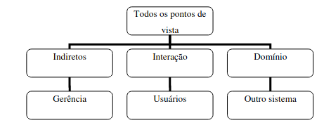

# Viewpoint

## 1. Introdução

&emsp;&emsp;O método VORD, se trata da definição dos requisitos orientada à pontos de vista. O principal objetivo dessa técnica é reconhecer várias perspectivas de um requisito, uma vez que usuários podem descrever um mesmo requisito, mas de maneira diferente. Nesse documento, fizemos os pontos de vista que cobriam as histórias de usuário com prioridade must.

## 2. Metodologia

&emsp;&emsp;Na metodologia VORD, existem dois pontos de vista principais:

- Interação (ou diretos), que interagem diretamente com o sistema.
- Indiretos, que são aqueles usuários que possuem interesse no sistema mas não tem contato direto com o software

&emsp;&emsp;Após identificar os pontos de vista, eles são agrupados de acordo com a hierarquia.

<figcaption align='center'>
    <b>Figura 1: Hierarquia dos pontos de vista</b>
     <small>Fonte: Samuel Fabiano Barbosa Silva. ENGENHARIA DE REQUISITOS:
Uma análise das técnicas de levantamento de requisitos</small>
</figcaption>

### 2.1.1 Viewpoint direto 1

&emsp;&emsp;O usuário deseja poder realizar o cadastro usando o seu email, ou usando a conta do google ou facebook, e assim ter acesso ao aplicativo.

### 2.1.2 Viewpoint indireto 1

&emsp;&emsp;O gerente do restaurante, deseja que o usuário consiga criar uma conta de forma rápida e simples.

### 2.2.1 Viewpoint direto 2

&emsp;&emsp;O usuário deseja que o login no aplicativo seja possível usando a conta criada previamente, para ter acesso ao aplicativo e fazer o seu pedido.

### 2.2.2 Viewpoint indireto 2

&emsp;&emsp;O gerente do restaurante, deseja que o usuário consiga logar no aplicativo de forma rápida e segura para que consiga fazer os seus pedidos.

### 2.3.1 Viewpoint direto 3

&emsp;&emsp;O usuário deseja que seja possível procurar pelo mapa os restaurantes e bares que estão no aplicativo.

### 2.3.2 Viewpoint indireto 3

&emsp;&emsp;O gerente do restaurante, deseja que o usuário consiga encontrar o seu restaurante ou bar pelo aplicativo, com a finalidade de atrair mais clientes

### 2.4.1 Viewpoint direto 4

&emsp;&emsp;O usuário deseja que seja possível acessar o cardápio e realizar pedidos com o seu celular.

### 2.4.2 Viewpoint indireto 4

&emsp;&emsp;O gerente do restaurante, deseja que o usuário consiga acessar o cardápio e realizar pedidos com o seu celular, com a finalidade de ter o atendimento agilizado.

### 2.5.1 Viewpoint direto 5

&emsp;&emsp;O usuário deseja que seja possível finalizar os pedidos e solicitar a conta, além de poder fazer o pagamento pelo aplicativo de forma segura.

### 2.5.2 Viewpoint indireto 5

&emsp;&emsp;O gerente do restaurante, deseja que o usuário consiga finalizar o seu pedido, pedir a conta e realizar o pagamento da forma desejada.

## 3. Análise final

&emsp;&emsp;Após a análise dos pontos de vista, conclui-se que não existem inconsistências, ou fatos faltantes, com isso não é necessário mudanças nos requisitos, uma vez que os pontos de vista estão alinhados.

## Referências
- SERRANO, Milene; SERRANO, Maurício. Requisitos - Aula 23. Material apresentado durante a disciplina de Requisitos de Software, FGA 2022.1.
- Messaoudi M. Requirements Engineering Through Viewpoints.
- Samuel Fabiano Barbosa Silva. ENGENHARIA DE REQUISITOS: Uma análise das técnicas de levantamento de requisitos
- Ahmed M. Salem. Requirements Analysis through Viewpoints Oriented Requirements Model (VORD)

## Histórico de versões

| Versão |                Alteração               | Responsável |         Revisor        |  Data |
|:------:|:--------------------------------------:|:-----------:|:----------------------:|:-----:|
|   1.0  | Criação do documento           |    Eurico  | João Henrique | 16/08 |
|   1.0  | Adição do conteúdo           |    Eurico  | João Henrique | 17/08 |
|   1.1  | Adição dos pontos de vista           |    Eurico  | João Henrique | 17/08 |