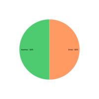
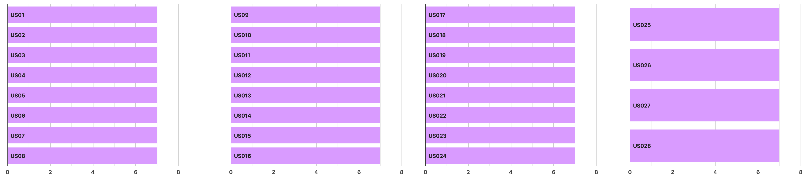

## 1. Introdução

&emsp;&emsp;Para verificar o Backlog do projeto de Requisitos de software do aplicativo Noruh, usaremos a estratégia de "inspeções", seguindo o planejamento detalhado na página de [Planejamento da Verificação](../verificacao/planejamento.md)

## 2. Preparação

&emsp;&emsp;Neste documento, iremos fazer a avaliação das [Histórias de Usuário](../../modelagem/historiasDeUsuario.md) e do [Backlog](../../modelagem/backlog.md). Para fazer a inspeção vamos utilizar um "checklist" com algumas perguntas com base nas referências utilizadas para a elaboração do artefato e os critérios de avaliação do artefato adotados na disciplina, dessa forma, podemos ver se o nosso está correto com base nessas perguntas. Quando o critério for atentido, terá um "check" confirmando e quando não estiver , terá um "X" dizendo que não está correto. Conforme a legenda abaixo:

- ✅ : Atendido
- ❌ : Não Atendido

&emsp;&emsp;Além disso, após identificarmos os erros presentes no artefato, iremos concertá-los, assim produzindo uma segunda versão do artefato e da checklist.

&emsp;&emsp;As checklists definidas podem ser encontradas a baixo:

|ID|Questão| Inspeção |
|-----------|-------------|-------------|
| 1 | Todas as histórias no backlog estão priorizadas?||
| 2 | Os épicos estão bem definidos?||
| 3 | Os temas estão bem definidos?||
| 4 | Apresenta rastreabilidade?||

<figcaption align='center'>
    <b>Tabela 1: Preparação checklist Backlog </b>
     <small> Fonte: Elaboração Própria </small>
</figcaption>

| ID | Questão | USn |
|---|---|---|
| 1 | Possui descrição clara e de fácil entendimento? |  |
| 2 | Possui rastreabilidade? |  |
| 3 | É possível identificar os atores? |  |
| 4 | É possível identificar os desejos dos atores? |  |
| 5 | A prioridade está correta? |  |
| 6 | Possui identificação? |  |
| 7 | Possui critérios de aceitação? |  |
| 8 | Os critérios estão claros e contemplam cada funcionalidade dentro da história?? |  |

<figcaption align='center'>
    <b>Tabela 2: Preparação Checklist Histórias de Usuário</b>
     <small> Fonte: Elaboração Própria </small>
</figcaption>

## 3. Inspeção Backlog do Produto
&emsp;&emsp;A checklist após inspeção da [versão 1 do backlog](../../modelagem/backlogV1.md) pode ser encontrado abaixo:

|ID|Questão| Inspeção |
|-----------|-------------|-------------|
| 1 | Todas as histórias no backlog estão priorizadas?| ✅|
| 2 | Os épicos estão bem definidos?|❌|
| 3 | Os temas estão bem definidos?|❌|
| 4 | Apresenta rastreabilidade?|✅|

<figcaption align='center'>
    <b>Tabela 3: Checklist Backlog V1 </b>
     <small> Fonte: Elaboração Própria </small>
</figcaption>

### 3.1 Resultados
&emsp;&emsp; Após a análise da checklist do produto verificamos que dos 4 critérios de avaliação nosso backlog cumpriu apenas 2 deles, assim gerando uma taxa de 50% de acertos. Como podemos ver pelo gráfico abaixo:

<figcaption align='center'>
    <b>Figura 1: Gráfico Inspeção Backlog </b>
     <small> Fonte: Elaboração Própria </small>
</figcaption>

&emsp;&emsp; Dessa forma com o objetivo de melhorarmos a qualidade do artefato, geramos uma segunda versão do mesmo cumprindo com os critérios da checklist.

### 3.2 Inspeção Backlog do Produto Versão 2
&emsp;&emsp;A versão 2 da checklist com os critérios de avaliação pode ser encontrado abaixo:

|ID|Questão| Inspeção |
|-----------|-------------|-------------|
| 1 | Todas as histórias no backlog estão priorizadas? |✅|
| 2 | Os épicos estão bem definidos?|✅|
| 3 | Os temas estão bem definidos?|✅|
| 4 | Apresenta rastreabilidade?|✅|

<figcaption align='center'>
    <b>Tabela 4: Checklist Backlog V2 </b>
     <small> Fonte: Elaboração Própria </small>
</figcaption>

### 3.3 Resultados
&emsp;&emsp; Com esta segunda versão do backlog, cumprimos com 100% dos critérios da checklist. Como podemos ver com o gráfico abaixo:

<figcaption align='center'>
    <b>Figura 2: Gráfico Inspeção Backlog Segunda Versão </b>
     <small> Fonte: Elaboração Própria </small>
</figcaption>

## 4. Inspeção Histórias de Usuário
&emsp;&emsp;A versão 1 da checklist após inspeção pode ser encontrado abaixo:

| ID | Questão | US01 | US02 | US03 | US04 | US05 | US06 | US07 | US08 | US09 | US10 | US11 | US12 | US13 | US14 |
|---|---|---|---|---|---|---|---|---|---|---|---|---|---|---|---|
| 1 | Possui descrição clara e de fácil entendimento? | ✅ |✅  |✅  |✅  |✅  |✅  |✅  |✅  |✅  |✅  |✅  |✅  |✅  |✅  |
| 2 | Possui rastreabilidade? | ✅ | ✅ | ✅ | ✅ | ✅ | ✅ | ✅ | ✅ | ✅ | ✅ | ✅ | ✅ | ✅ | ✅ |
| 3 | É possível identificar os atores? | ✅ | ✅ | ✅ | ✅ | ✅ | ✅ | ✅ | ✅ | ✅ |✅  |✅  |✅  |✅  |✅  |
| 4 | É possível identificar os desejos dos atores? | ✅ | ✅ | ✅ | ✅ | ✅ | ✅ | ✅ | ✅ | ✅ | ✅ | ✅ | ✅ | ✅ | ✅ |
| 5 | A prioridade está correta? | ✅ | ✅ | ✅ | ✅ | ✅ | ✅ | ✅ | ✅ | ✅ | ✅ | ✅ | ✅ | ✅ | ✅ |
| 6 | Possui identificação? | ✅ | ✅ | ✅ | ✅ | ✅ | ✅ | ✅ | ✅ | ✅ | ✅ | ✅ | ✅ | ✅ | ✅ |
| 7 | Possui critérios de aceitação? | ✅ | ✅ | ✅ | ✅ | ✅ | ✅ | ✅ | ✅ | ✅ | ✅ | ✅ | ✅ | ✅ | ✅ |
| 8 | Os critérios estão claros e contemplam cada funcionalidade dentro da história? | ❌ | ❌ | ❌ | ❌ | ❌ | ❌ | ❌ | ❌ | ❌ | ❌ | ❌ | ❌ | ❌ | ❌ |

<figcaption align='center'>
    <b>Tabela 5: Checklist Histórias de Usuário US01-US14 </b>
     <small> Fonte: Elaboração Própria </small>
</figcaption>

| ID | Questão | US15 | US16 | US17 | US18 | US19 | US20 | US21 | US22 | US23 | US24 | US25 | US26 | US27 | US28 |
|---|---|---|---|---|---|---|---|---|---|---|---|---|---|---|---|
| 1 | Possui descrição clara e de fácil entendimento? | ✅ | ✅ | ✅ | ✅ | ✅ | ✅ | ✅ | ✅ | ✅ | ✅ | ✅ | ✅ | ✅ | ✅ |
| 2 | Possui rastreabilidade? | ✅ | ✅ | ✅ | ✅ | ✅ | ✅ | ✅ | ✅ | ✅ | ✅ | ✅ | ✅ | ✅ | ✅ |
| 3 | É possível identificar os atores? | ✅ | ✅ | ✅ | ✅ | ✅ | ✅ | ✅ | ✅ | ✅ | ✅ | ✅ | ✅ | ✅ | ✅ |
| 4 | É possível identificar os desejos dos atores? | ✅ | ✅ | ✅ | ✅ | ✅ | ✅ | ✅ | ✅ | ✅ | ✅ | ✅ | ✅ | ✅ | ✅ |
| 5 | A prioridade está correta? | ✅ | ✅ | ✅ | ✅ | ✅ | ✅ | ✅ | ✅ | ✅ | ✅ | ✅ | ✅ | ✅ | ✅ |
| 6 | Possui identificação? | ✅ | ✅ | ✅ | ✅ | ✅ | ✅ | ✅ | ✅ | ✅ | ✅ | ✅ | ✅ |✅  | ✅ |
| 7 | Possui critérios de aceitação? | ✅ | ✅ | ✅ | ✅ | ✅ | ✅ | ✅ | ✅ |  ✅|  ✅|  ✅|  ✅|  ✅|  ✅|
| 8 | Os critérios estão claros e contemplam cada funcionalidade dentro da história? | ❌ | ❌ | ❌ | ❌ | ❌ | ❌ | ❌ | ❌ | ❌ | ❌ | ❌ | ❌ | ❌ | ❌ |

<figcaption align='center'>
    <b>Tabela 6: Checklist Histórias de Usuário US15-US28 </b>
     <small> Fonte: Elaboração Própria </small>
</figcaption>

## 4.2 Resultados
&emsp;&emsp;A partir da inspeção feita nas histórias de usuário,como podemos observar no gráfico abaixo, todas as histórias de usuário possuem um erro em comum nos critérios de aceitação. Assim mantendo uma taxa de acertos de quase 90% por história de usuário.

<figcaption align='center'>
    <b>Figura 3: Gráfico Inspeção História de Usuário </b>
     <small> Fonte: Elaboração Própria </small>
</figcaption>

## Referências
- SERRANO, Maurício; SERRANO, Milene. Requisitos - Aula 23. 1º/2022. Material apresentado para a disciplina de Requisitos de Software no curso de Engenharia de Software da UnB, FGA.

- Lista de Verificação da Qualidade de Artefatos - Checklist Ágil. Ministério da Agricultura, Pecuária e Abastecimento. Disponível em:  [link](https://www.gov.br/agricultura/pt-br/pregao-eletronico-no-05-2018/diretrizes/lista-de-verificacao-da-qualidade-de-artefatos-checklist-agil.xls/view)

## Histórico de versão
| Versão |      Alteração      | Responsável |           Revisor            |   Data   | Hora  |
| :----: | :-----------------: | :---------: | :--------------------------: | :------: | :------: |
|  1.0   |      Criação do documento          |    Lucas   |-               | 14/08/22 |13:00 às 16:35 |
