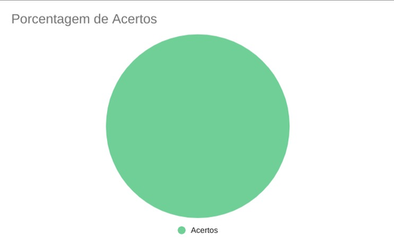
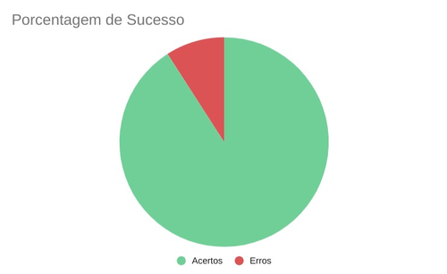

## 1. Introdução

&emsp;&emsp;Para verificar os Casos de Uso do projeto de Requisitos de software do aplicativo Noruh, usaremos a estratégia de "inspeções", no qual se objetiva o descobrimento de defeitos em documentos, buscando assim achar os defeitos em nossos Casos de Uso.

## 2. Preparação

&emsp;&emsp;Baseado na metodologia adotada no [Planejamento da Verificação](planejamento.md), a preparação, inspeção e acompanhamento da verificação serão feitos a partir de um *checklist* com algumas perguntas com base nas referências sobre casos de uso citadas nessa página que mostram como fazer um caso de uso, dessa forma, podemos ver se o nosso está correto com base nessas perguntas. Quando estiver correto, terá um "check" confirmando e quando estiver errado, terá um "X" dizendo que não está correto. Conforme a legenda abaixo:

- ✅ : Atendido
- ❌ : Não Atendido

&emsp;&emsp;A checklist a ser seguida encontra-se abaixo na Tabela 1.

|ID|Questão|
|-----------|-------------|
| 1 | O caso de uso possui fluxo principal? |
| 2 | O caso de uso possui fluxo alternativo? |
| 3 | O caso de uso possui fluxo de exceção? |
| 4 | Os verbos estão no infinitivo? |
| 5 | Há apenas informações necessárias? |
| 6 | O ator principal está do lado direito do sistema? |
| 7 | Os atores secundários estão do lado esquerdo do sistema? |
| 8 | Os atores estão fora da caixa de limite sistema? |
| 9 | As setas indicam o fluxo corretamente? |
| 10 | O caso de uso possui pré-condições? |
| 11 | O caso de uso possui pós-condições? |
| 12 | A tabela está coerente com o diagrama? |
| 13 | Há explicação dos elementos? |

<figcaption align='center'>
    <b>Tabela 1: Modelo de checklist</b>
     <small> Fonte: Elaboração Própria </small>
</figcaption>

&emsp;&emsp;Além disso, após a inspeção dos elementos da checklist, iremos gerar um gŕafico de acompanhamento e fazer a correção dos erros encontrados, assim produzindo uma segunda versão do artefato e da checklist.

## 3. Inspeção: Checklist dos Casos de Uso

### 3.1 Fluxo de Conta

|ID|Questão| Inspeção |
|-----------|-------------|-------------|
| 1 | O caso de uso possui fluxo principal? | ✅ |
| 2 | O caso de uso possui fluxo alternativo? | ✅ |
| 3 | O caso de uso possui fluxo de exceção? | ✅ |
| 4 | Os verbos estão no infinitivo? | ✅ |
| 5 | Há apenas informações necessárias? | ✅ |
| 6 | O ator principal está do lado direito do sistema? | ✅ |
| 7 | Os atores secundários estão do lado esquerdo do sistema? | Não se aplica |
| 8 | Os atores estão fora da caixa de limite sistema? | ✅ |
| 9 | As setas indicam o fluxo corretamente? | ✅ |
| 10 | O caso de uso possui pré-condições? | ✅ |
| 11 | O caso de uso possui pós-condições? | ✅ |
| 12 | A tabela está coerente com o diagrama? | ✅ |
| 13 | Há explicação dos elementos? | ✅ |

<figcaption align='center'>
    <b>Tabela 2: Checklist do Fluxo de Conta </b>
     <small> Fonte: Elaboração Própria </small>
</figcaption>

#### 3.1.1 Acompanhamento: Porcentagem de sucesso do checklist
- 0 ERROS e 12 ACERTOS
- 100% de acertos

<figcaption align='center'>
    <b>Gráfico 1: Porcentagem de sucesso do checklist de Fluxo de Conta </b>
     <small> Fonte: Elaboração Própria </small>
</figcaption>

### 3.2 Fluxo de Pedido

|ID|Questão| Inspeção |
|-----------|-------------|-------------|
| 1 | O caso de uso possui fluxo principal? | ✅ |
| 2 | O caso de uso possui fluxo alternativo? | Não se aplica |
| 3 | O caso de uso possui fluxo de exceção? | Não se aplica |
| 4 | Os verbos estão no infinitivo? | ❌ |
| 5 | Há apenas informações necessárias? | ✅ |
| 6 | O ator principal está do lado direito do sistema? | ✅ |
| 7 | Os atores secundários estão do lado esquerdo do sistema? | ✅ |
| 8 | Os atores estão fora da caixa de limite sistema? | ✅ |
| 9 | As setas indicam o fluxo corretamente? | ✅ |
| 10 | O caso de uso possui pré-condições? | ✅ |
| 11 | O caso de uso possui pós-condições? | ✅ |
| 12 | A tabela está coerente com o diagrama? | ✅ |
| 13 | Há explicação dos elementos? | ✅ |

<figcaption align='center'>
    <b>Tabela 3: Checklist do Fluxo de Pedido Versão 1 </b>
     <small> Fonte: Elaboração Própria </small>
</figcaption>

#### 3.2.1 Porcentagem de sucesso do checklist
- 1 ERROS e 10 ACERTOS
- 90,9% de acertos

<figcaption align='center'>
    <b>Gráfico 2: Porcentagem de sucesso do checklist de Fluxo de Pedido </b>
     <small> Fonte: Elaboração Própria </small>
</figcaption>

### 3.3 Fluxo de Pesquisa e Página do Restaurante

|ID|Questão| Inspeção |
|-----------|-------------|-------------|
| 1 | O caso de uso possui fluxo principal? | ✅ |
| 2 | O caso de uso possui fluxo alternativo? | ✅ |
| 3 | O caso de uso possui fluxo de exceção? | Não se aplica |
| 4 | Os verbos estão no infinitivo? | ❌ |
| 5 | Há apenas informações necessárias? | ✅ |
| 6 | O ator principal está do lado direito do sistema? | ✅ |
| 7 | Os atores secundários estão do lado esquerdo do sistema? | Não se aplica |
| 8 | Os atores estão fora da caixa de limite sistema? | ✅ |
| 9 | As setas indicam o fluxo corretamente? | ✅ |
| 10 | O caso de uso possui pré-condições? | ✅ |
| 11 | O caso de uso possui pós-condições? | ✅ |
| 12 | A tabela está coerente com o diagrama? | ✅ |
| 13 | Há explicação dos elementos? | ✅ |

<figcaption align='center'>
    <b>Tabela 4: Checklist do Fluxo de Pesquisa e Página do Restaurante Versão 1 </b>
     <small> Fonte: Elaboração Própria </small>
</figcaption>

#### 3.3.1 Porcentagem de sucesso do checklist
- 1 ERROS e 10 ACERTOS
- 90,9% de acertos

<figcaption align='center'>
    <b>Gráfico 3: Porcentagem de sucesso do checklist de Fluxo de Pesquisa e Página do Restaurante </b>
     <small> Fonte: Elaboração Própria </small>
</figcaption>

## 4. Correção

&emsp;&emsp;Após a execução da etapa de Inspeção utilizando os checklists, apenas os Fluxos de Pedido e o Fluxo de Pesquisa e Página do Restaurante apresentaram um item a ser corrigido, que segue listado abaixo.

|ID|Questão|
|-----------|-------------|
| 4 | Os verbos estão no infinitivo? |

&emsp;&emsp;Assim, a fim de eliminar inconsistências nos artefatos tal item foi corrigido no documento de [Casos de Uso](../../modelagem/casosDeUso.md), e uma nova inspecção foi feita gerando as segundas versões dos checklists e gráficos do Fluxo de Pedido e do Fluxo de Pesquisa e Página do Restaurante.

### 4.1 Checklists dos Casos de Uso Versão 2

&emsp;&emsp;A versão 2 dos checklists com os critérios de avaliação pode ser encontrada abaixo:

#### 4.1.1 Fluxo de Pedido

|ID|Questão| Inspeção |
|-----------|-------------|-------------|
| 1 | O caso de uso possui fluxo principal? | ✅ |
| 2 | O caso de uso possui fluxo alternativo? | Não se aplica |
| 3 | O caso de uso possui fluxo de exceção? | Não se aplica |
| 4 | Os verbos estão no infinitivo? | ✅ |
| 5 | Há apenas informações necessárias? | ✅ |
| 6 | O ator principal está do lado direito do sistema? | ✅ |
| 7 | Os atores secundários estão do lado esquerdo do sistema? | ✅ |
| 8 | Os atores estão fora da caixa de limite sistema? | ✅ |
| 9 | As setas indicam o fluxo corretamente? | ✅ |
| 10 | O caso de uso possui pré-condições? | ✅ |
| 11 | O caso de uso possui pós-condições? | ✅ |
| 12 | A tabela está coerente com o diagrama? | ✅ |
| 13 | Há explicação dos elementos? | ✅ |

<figcaption align='center'>
    <b>Tabela 5: Checklist versão 2 do Fluxo de Pedido Versão 2 </b>
     <small> Fonte: Elaboração Própria </small>
</figcaption>

#### 4.1.2 Fluxo de Pesquisa e Página do Restaurante

|ID|Questão| Inspeção |
|-----------|-------------|-------------|
| 1 | O caso de uso possui fluxo principal? | ✅ |
| 2 | O caso de uso possui fluxo alternativo? | ✅ |
| 3 | O caso de uso possui fluxo de exceção? | Não se aplica |
| 4 | Os verbos estão no infinitivo? | ✅ |
| 5 | Há apenas informações necessárias? | ✅ |
| 6 | O ator principal está do lado direito do sistema? | ✅ |
| 7 | Os atores secundários estão do lado esquerdo do sistema? | Não se aplica |
| 8 | Os atores estão fora da caixa de limite sistema? | ✅ |
| 9 | As setas indicam o fluxo corretamente? | ✅ |
| 10 | O caso de uso possui pré-condições? | ✅ |
| 11 | O caso de uso possui pós-condições? | ✅ |
| 12 | A tabela está coerente com o diagrama? | ✅ |
| 13 | Há explicação dos elementos? | ✅ |

<figcaption align='center'>
    <b>Tabela 6: Checklist do Fluxo de Pesquisa e Página do Restaurante Versão 2 </b>
     <small> Fonte: Elaboração Própria </small>
</figcaption>

## 4.2 Gráficos da Porcentagem de Sucesso
&emsp;&emsp;A versão 2 do gráfico de acompanhamento da porcentagem de sucesso dos checklists de todos os fluxos pode ser encontrado abaixo:

<figcaption align='center'>
    <b>Gráfico 4: Porcentagem de sucesso do checklist de Todos os Fluxos </b>
     <small> Fonte: Elaboração Própria </small>
</figcaption>

## Referências
- SERRANO, Maurício; SERRANO, Milene. Requisitos - Aula 23. 1º/2022. Material apresentado para a disciplina de Requisitos de Software no curso de Engenharia de Software da UnB, FGA.
- SERRANO, Maurício; SERRANO, Milene. Requisitos - Aula 13. 1º/2022. Material apresentado para a disciplina de Requisitos de Software no curso de Engenharia de Software da UnB, FGA.

## Histórico de versão
| Versão |      Alteração      | Responsável |           Revisor            |   Data   | 
| :----: | :-----------------: | :---------: | :--------------------------: | :------: | 
|  1.0   |      Criação do documento          |    Karla   |       -        | 15/08/22 |
|  1.1   | Adição do acompanhamento e correções |    Karla   |       -        | 16/08/22 |
