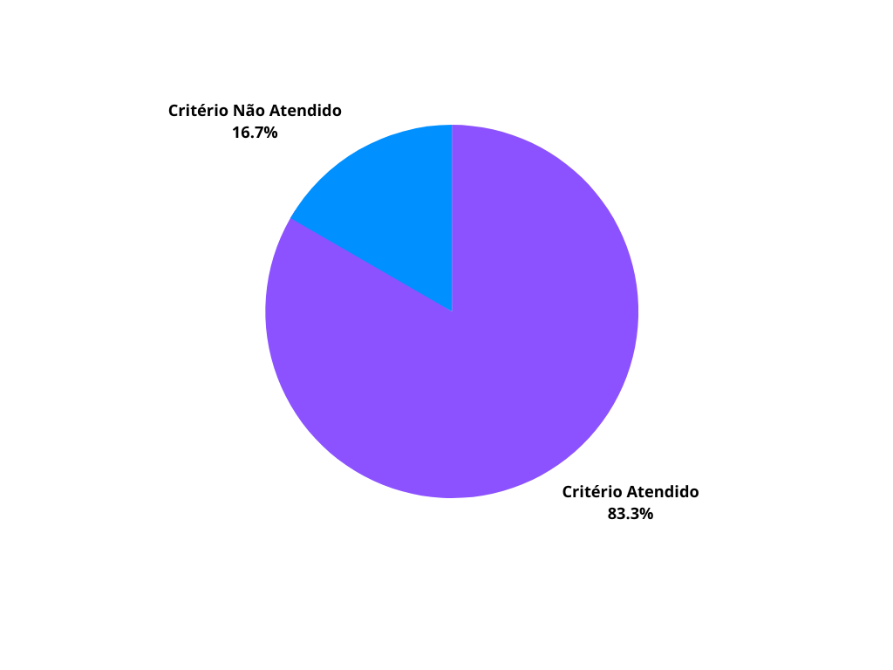
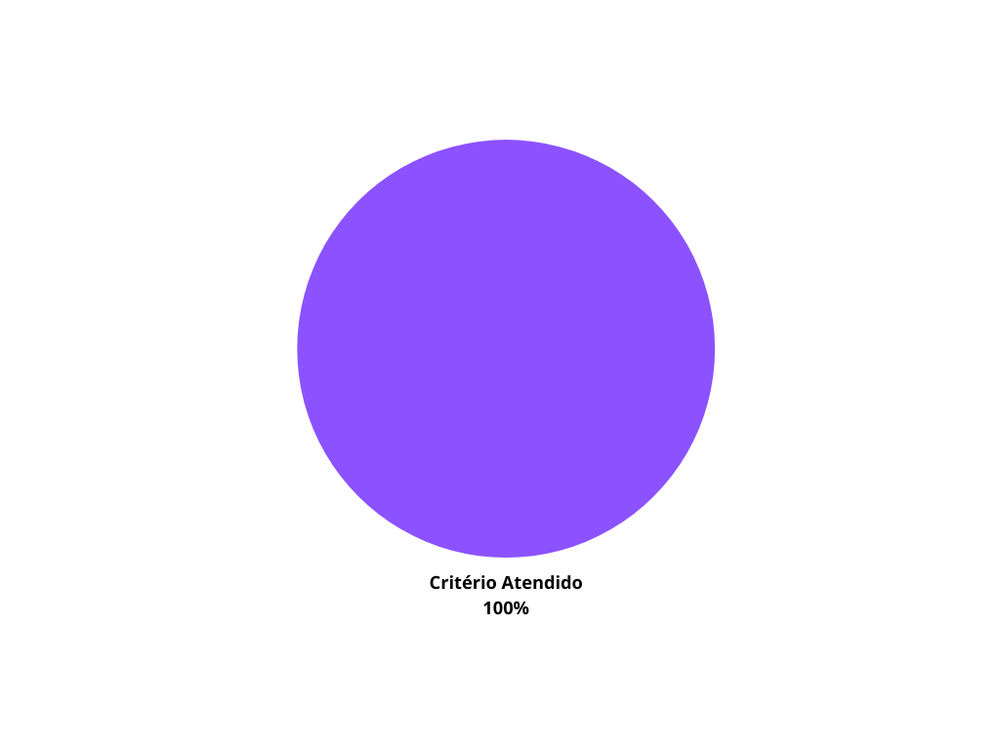

## 1. Introdução

&emsp;&emsp;Para verificar os cenários do projeto de Requisitos de software do aplicativo Noruh, usaremos a estratégia de "inspeções", seguindo o planejamento detalhado na página de [Planejamento da Verificação](../verificacao/planejamento.md)

## 2. Preparação

&emsp;&emsp;Para executar a inspeção, utilizaremos um "checklist" com algumas perguntas com base nas referências sobre cenários adotados na disciplina. Para o "checklist" utilizaremos o seguinte modelo:

- ✅ : Critério Atendido
- ❌ : Critério Não Atendido

&emsp;&emsp;Além disso, após identificarmos os erros presentes no artefato, iremos concertá-los, assim produzindo uma segunda versão do artefato e da checklist.

&emsp;&emsp;A checklist definida pode ser encontrada a baixo:

| ID  |                                    Questão                                    | Inspeção |
| :-: | :---------------------------------------------------------------------------: | :------: |
|  1  | Os cenários possuem título, objetivo, contexto, recurso, episódios e exceção? |          |
|  2  |                   É possível associar o título ao objetivo?                   |          |
|  3  |                         O contexto foi bem definido?                          |          |
|  4  |                     Os atores foram colocados no cenário?                     |          |
|  5  |              Os episódios ajudam a atingir o objetivo descrito?               |          |
|  6  |        Os recursos são realmente necessários e estão todos presentes?         |          |

<figcaption align='center'>
    <b>Tabela 1: Preparação Checklist Cenários </b>
     <small> Fonte: Elaboração Própria </small>
</figcaption>

## 3. Checklist dos Cenários Versão 1

### 3.0.1 Cenário 1: Criar perfil

| ID  |                                    Questão                                    | Inspeção |
| :-: | :---------------------------------------------------------------------------: | :------: |
|  1  | Os cenários possuem título, objetivo, contexto, recurso, episódios e exceção? |    ✅    |
|  2  |                   É possível associar o título ao objetivo?                   |    ✅    |
|  3  |                         O contexto foi bem definido?                          |    ❌    |
|  4  |                     Os atores foram colocados no cenário?                     |    ✅    |
|  5  |              Os episódios ajudam a atingir o objetivo descrito?               |    ✅    |
|  6  |        Os recursos são realmente necessários e estão todos presentes?         |    ✅    |

<figcaption align='center'>
    <b>Tabela 2: Checklist Criar Perfil Versão 1 </b>
     <small> Fonte:  Elaboração Própria </small>
</figcaption>

### 3.0.2 Cenário 2: Logout no perfil

| ID  |                                    Questão                                    | Inspeção |
| :-: | :---------------------------------------------------------------------------: | :------: |
|  1  | Os cenários possuem título, objetivo, contexto, recurso, episódios e exceção? |    ✅    |
|  2  |                   É possível associar o título ao objetivo?                   |    ✅    |
|  3  |                         O contexto foi bem definido?                          |    ❌    |
|  4  |                     Os atores foram colocados no cenário?                     |    ✅    |
|  5  |              Os episódios ajudam a atingir o objetivo descrito?               |    ✅    |
|  6  |        Os recursos são realmente necessários e estão todos presentes?         |    ✅    |

<figcaption align='center'>
    <b>Tabela 3: Checklist Logout no Perfil Versão 1 </b>
     <small> Fonte:  Elaboração Própria </small>
</figcaption>

### 3.0.3 Cenário 3: Cadastrar endereço

| ID  |                                    Questão                                    | Inspeção |
| :-: | :---------------------------------------------------------------------------: | :------: |
|  1  | Os cenários possuem título, objetivo, contexto, recurso, episódios e exceção? |    ✅    |
|  2  |                   É possível associar o título ao objetivo?                   |    ✅    |
|  3  |                         O contexto foi bem definido?                          |    ❌    |
|  4  |                     Os atores foram colocados no cenário?                     |          |
|  5  |              Os episódios ajudam a atingir o objetivo descrito?               |          |
|  6  |        Os recursos são realmente necessários e estão todos presentes?         |    ✅    |

<figcaption align='center'>
    <b>Tabela 4: Checklist Cadastrar Endereço Versão 1 </b>
     <small> Fonte:  Elaboração Própria </small>
</figcaption>

### 3.0.4 Cenário 4: Cadastrar forma de pagamento

| ID  |                                    Questão                                    | Inspeção |
| :-: | :---------------------------------------------------------------------------: | :------: |
|  1  | Os cenários possuem título, objetivo, contexto, recurso, episódios e exceção? |    ✅    |
|  2  |                   É possível associar o título ao objetivo?                   |    ✅    |
|  3  |                         O contexto foi bem definido?                          |    ❌    |
|  4  |                     Os atores foram colocados no cenário?                     |    ✅    |
|  5  |              Os episódios ajudam a atingir o objetivo descrito?               |    ✅    |
|  6  |        Os recursos são realmente necessários e estão todos presentes?         |    ✅    |

<figcaption align='center'>
    <b>Tabela 5: Checklist Cadastrar Forma de Pagamento Versão 1 </b>
     <small> Fonte:  Elaboração Própria </small>
</figcaption>

### 3.0.5 Cenário 5: Pesquisa de estabelecimentos

| ID  |                                    Questão                                    | Inspeção |
| :-: | :---------------------------------------------------------------------------: | :------: |
|  1  | Os cenários possuem título, objetivo, contexto, recurso, episódios e exceção? |    ✅    |
|  2  |                   É possível associar o título ao objetivo?                   |    ✅    |
|  3  |                         O contexto foi bem definido?                          |    ❌    |
|  4  |                     Os atores foram colocados no cenário?                     |    ✅    |
|  5  |              Os episódios ajudam a atingir o objetivo descrito?               |    ✅    |
|  6  |        Os recursos são realmente necessários e estão todos presentes?         |    ✅    |

<figcaption align='center'>
    <b>Tabela 6: Checklist Pesquisa de Estabelecimentos Versão 1 </b>
     <small> Fonte:  Elaboração Própria </small>
</figcaption>

### 3.0.6 Cenário 6: Forma de pagamento

| ID  |                                    Questão                                    | Inspeção |
| :-: | :---------------------------------------------------------------------------: | :------: |
|  1  | Os cenários possuem título, objetivo, contexto, recurso, episódios e exceção? |    ✅    |
|  2  |                   É possível associar o título ao objetivo?                   |    ✅    |
|  3  |                         O contexto foi bem definido?                          |    ❌    |
|  4  |                     Os atores foram colocados no cenário?                     |    ✅    |
|  5  |              Os episódios ajudam a atingir o objetivo descrito?               |    ✅    |
|  6  |        Os recursos são realmente necessários e estão todos presentes?         |    ✅    |

<figcaption align='center'>
    <b>Tabela 7: Checklist Forma de Pagamento Versão 1 </b>
     <small> Fonte:  Elaboração Própria </small>
</figcaption>

### 3.0.7 Cenário 7: Edição do perfil

| ID  |                                    Questão                                    | Inspeção |
| :-: | :---------------------------------------------------------------------------: | :------: |
|  1  | Os cenários possuem título, objetivo, contexto, recurso, episódios e exceção? |    ✅    |
|  2  |                   É possível associar o título ao objetivo?                   |    ✅    |
|  3  |                         O contexto foi bem definido?                          |    ❌    |
|  4  |                     Os atores foram colocados no cenário?                     |    ✅    |
|  5  |              Os episódios ajudam a atingir o objetivo descrito?               |    ✅    |
|  6  |        Os recursos são realmente necessários e estão todos presentes?         |    ✅    |

<figcaption align='center'>
    <b>Tabela 8: Checklist Edição do Perfil Versão 1 </b>
     <small> Fonte:  Elaboração Própria </small>
</figcaption>

### 3.0.8 Cenário 8: Escolha da cidade

| ID  |                                    Questão                                    | Inspeção |
| :-: | :---------------------------------------------------------------------------: | :------: |
|  1  | Os cenários possuem título, objetivo, contexto, recurso, episódios e exceção? |    ✅    |
|  2  |                   É possível associar o título ao objetivo?                   |    ✅    |
|  3  |                         O contexto foi bem definido?                          |    ❌    |
|  4  |                     Os atores foram colocados no cenário?                     |    ✅    |
|  5  |              Os episódios ajudam a atingir o objetivo descrito?               |    ✅    |
|  6  |        Os recursos são realmente necessários e estão todos presentes?         |    ✅    |

<figcaption align='center'>
    <b>Tabela 9: Checklist Escolha da Cidade Versão 1 </b>
     <small> Fonte:  Elaboração Própria </small>
</figcaption>

### 3.0.9 Cenário 9: Pedido no estabelecimento

| ID  |                                    Questão                                    | Inspeção |
| :-: | :---------------------------------------------------------------------------: | :------: |
|  1  | Os cenários possuem título, objetivo, contexto, recurso, episódios e exceção? |    ✅    |
|  2  |                   É possível associar o título ao objetivo?                   |    ✅    |
|  3  |                         O contexto foi bem definido?                          |    ❌    |
|  4  |                     Os atores foram colocados no cenário?                     |    ✅    |
|  5  |              Os episódios ajudam a atingir o objetivo descrito?               |    ✅    |
|  6  |        Os recursos são realmente necessários e estão todos presentes?         |    ✅    |

<figcaption align='center'>
    <b>Tabela 10: Checklist Pedido no Estabelecimento Versão 1 </b>
     <small> Fonte:  Elaboração Própria </small>
</figcaption>

### 3.1 Melhorias

&emsp;&emsp;Após a análise da checklist do produto, verificamos que nenhum dos cenários atenderam o critério em relação ao contexto, assim gerando uma taxa de 83,33% de acertos.

<figcaption align='center'>
    <b>Figura 11: Gráfico Verificação Cenários </b>
     <small> Fonte: Elaboração Própria </small>
</figcaption>

&emsp;&emsp;Dessa forma com o objetivo de melhorarmos este critério, detalhamos mais a pré-condição do contexto de cada cenário, e assim, geramos uma segunda versão do mesmo cumprindo com os critérios da checklist.

### 3.2 Checklist dos Cenários Versão 2

&emsp;&emsp;A versão 2 da checklist com os critérios de avaliação pode ser encontrado abaixo:

### 3.2.1 Cenário 1: Criar perfil

| ID  |                                    Questão                                    | Inspeção |
| :-: | :---------------------------------------------------------------------------: | :------: |
|  1  | Os cenários possuem título, objetivo, contexto, recurso, episódios e exceção? |    ✅    |
|  2  |                   É possível associar o título ao objetivo?                   |    ✅    |
|  3  |                         O contexto foi bem definido?                          |    ✅    |
|  4  |                     Os atores foram colocados no cenário?                     |    ✅    |
|  5  |              Os episódios ajudam a atingir o objetivo descrito?               |    ✅    |
|  6  |        Os recursos são realmente necessários e estão todos presentes?         |    ✅    |

<figcaption align='center'>
    <b>Tabela 12: Checklist Criar Perfil Versão 2 </b>
     <small> Fonte:  Elaboração Própria </small>
</figcaption>

### 3.2.2 Cenário 2: Logout no perfil

| ID  |                                    Questão                                    | Inspeção |
| :-: | :---------------------------------------------------------------------------: | :------: |
|  1  | Os cenários possuem título, objetivo, contexto, recurso, episódios e exceção? |    ✅    |
|  2  |                   É possível associar o título ao objetivo?                   |    ✅    |
|  3  |                         O contexto foi bem definido?                          |    ✅    |
|  4  |                     Os atores foram colocados no cenário?                     |    ✅    |
|  5  |              Os episódios ajudam a atingir o objetivo descrito?               |    ✅    |
|  6  |        Os recursos são realmente necessários e estão todos presentes?         |    ✅    |

<figcaption align='center'>
    <b>Tabela 13: Checklist Logout no Perfil Versão 2 </b>
     <small> Fonte:  Elaboração Própria </small>
</figcaption>

### 3.2.3 Cenário 3: Cadastrar endereço

| ID  |                                    Questão                                    | Inspeção |
| :-: | :---------------------------------------------------------------------------: | :------: |
|  1  | Os cenários possuem título, objetivo, contexto, recurso, episódios e exceção? |    ✅    |
|  2  |                   É possível associar o título ao objetivo?                   |    ✅    |
|  3  |                         O contexto foi bem definido?                          |    ✅    |
|  4  |                     Os atores foram colocados no cenário?                     |    ✅    |
|  5  |              Os episódios ajudam a atingir o objetivo descrito?               |    ✅    |
|  6  |        Os recursos são realmente necessários e estão todos presentes?         |    ✅    |

<figcaption align='center'>
    <b>Tabela 14: Checklist Cadastrar Endereço Versão 2 </b>
     <small> Fonte:  Elaboração Própria </small>
</figcaption>

### 3.2.4 Cenário 4: Cadastrar forma de pagamento

| ID  |                                    Questão                                    | Inspeção |
| :-: | :---------------------------------------------------------------------------: | :------: |
|  1  | Os cenários possuem título, objetivo, contexto, recurso, episódios e exceção? |    ✅    |
|  2  |                   É possível associar o título ao objetivo?                   |    ✅    |
|  3  |                         O contexto foi bem definido?                          |    ✅    |
|  4  |                     Os atores foram colocados no cenário?                     |    ✅    |
|  5  |              Os episódios ajudam a atingir o objetivo descrito?               |    ✅    |
|  6  |        Os recursos são realmente necessários e estão todos presentes?         |    ✅    |

<figcaption align='center'>
    <b>Tabela 15: Checklist Cadastrar Forma de Pagamento Versão 2 </b>
     <small> Fonte:  Elaboração Própria </small>
</figcaption>

### 3.2.5 Cenário 5: Pesquisa de estabelecimentos

| ID  |                                    Questão                                    | Inspeção |
| :-: | :---------------------------------------------------------------------------: | :------: |
|  1  | Os cenários possuem título, objetivo, contexto, recurso, episódios e exceção? |    ✅    |
|  2  |                   É possível associar o título ao objetivo?                   |    ✅    |
|  3  |                         O contexto foi bem definido?                          |    ✅    |
|  4  |                     Os atores foram colocados no cenário?                     |    ✅    |
|  5  |              Os episódios ajudam a atingir o objetivo descrito?               |    ✅    |
|  6  |        Os recursos são realmente necessários e estão todos presentes?         |    ✅    |

<figcaption align='center'>
    <b>Tabela 16: Checklist Pesquisa de Estabelecimentos Versão 2 </b>
     <small> Fonte:  Elaboração Própria </small>
</figcaption>

### 3.2.6 Cenário 6: Forma de pagamento

| ID  |                                    Questão                                    | Inspeção |
| :-: | :---------------------------------------------------------------------------: | :------: |
|  1  | Os cenários possuem título, objetivo, contexto, recurso, episódios e exceção? |    ✅    |
|  2  |                   É possível associar o título ao objetivo?                   |    ✅    |
|  3  |                         O contexto foi bem definido?                          |    ✅    |
|  4  |                     Os atores foram colocados no cenário?                     |    ✅    |
|  5  |              Os episódios ajudam a atingir o objetivo descrito?               |    ✅    |
|  6  |        Os recursos são realmente necessários e estão todos presentes?         |    ✅    |

<figcaption align='center'>
    <b>Tabela 17: Checklist Forma de Pagamento Versão 2 </b>
     <small> Fonte:  Elaboração Própria </small>
</figcaption>

### 3.2.7 Cenário 7: Edição do perfil

| ID  |                                    Questão                                    | Inspeção |
| :-: | :---------------------------------------------------------------------------: | :------: |
|  1  | Os cenários possuem título, objetivo, contexto, recurso, episódios e exceção? |    ✅    |
|  2  |                   É possível associar o título ao objetivo?                   |    ✅    |
|  3  |                         O contexto foi bem definido?                          |    ✅    |
|  4  |                     Os atores foram colocados no cenário?                     |    ✅    |
|  5  |              Os episódios ajudam a atingir o objetivo descrito?               |    ✅    |
|  6  |        Os recursos são realmente necessários e estão todos presentes?         |    ✅    |

<figcaption align='center'>
    <b>Tabela 18: Checklist Edição do Perfil Versão 2 </b>
     <small> Fonte:  Elaboração Própria </small>
</figcaption>

### 3.8 Cenário 8: Escolha da cidade

| ID  |                                    Questão                                    | Inspeção |
| :-: | :---------------------------------------------------------------------------: | :------: |
|  1  | Os cenários possuem título, objetivo, contexto, recurso, episódios e exceção? |    ✅    |
|  2  |                   É possível associar o título ao objetivo?                   |    ✅    |
|  3  |                         O contexto foi bem definido?                          |    ✅    |
|  4  |                     Os atores foram colocados no cenário?                     |    ✅    |
|  5  |              Os episódios ajudam a atingir o objetivo descrito?               |    ✅    |
|  6  |        Os recursos são realmente necessários e estão todos presentes?         |    ✅    |

<figcaption align='center'>
    <b>Tabela 19: Checklist Escolha da Cidade Versão 2 </b>
     <small> Fonte:  Elaboração Própria </small>
</figcaption>

### 3.2.9 Cenário 9: Pedido no estabelecimento

| ID  |                                    Questão                                    | Inspeção |
| :-: | :---------------------------------------------------------------------------: | :------: |
|  1  | Os cenários possuem título, objetivo, contexto, recurso, episódios e exceção? |    ✅    |
|  2  |                   É possível associar o título ao objetivo?                   |    ✅    |
|  3  |                         O contexto foi bem definido?                          |    ✅    |
|  4  |                     Os atores foram colocados no cenário?                     |    ✅    |
|  5  |              Os episódios ajudam a atingir o objetivo descrito?               |    ✅    |
|  6  |        Os recursos são realmente necessários e estão todos presentes?         |    ✅    |

<figcaption align='center'>
    <b>Tabela 20: Checklist Pedido no Estabelecimento Versão 2 </b>
     <small> Fonte:  Elaboração Própria </small>
</figcaption>

### 3.3 Resultados

&emsp;&emsp;Com a segunda versão do checklist, cumprimos 100% dos critérios da checklist, como é demonstrado no gráfico abaixo:

<figcaption align='center'>
    <b>Figura 2: Gráfico Verificação Cenários Versão 2 </b>
     <small> Fonte: Elaboração Própria </small>
</figcaption>

## Referências

- SERRANO, Maurício; SERRANO, Milene. Requisitos - Aula 23. 1º/2022. Material apresentado para a disciplina de Requisitos de Software no curso de Engenharia de Software da UnB, FGA.

## Histórico de versão

| Versão |      Alteração       | Responsável | Revisor |   Data   |      Hora      |
| :----: | :------------------: | :---------: | :-----: | :------: | :------------: |
|  1.0   | Criação do documento |    Bruno    |    -    | 15/08/22 | 21:40 às 22:35 |
