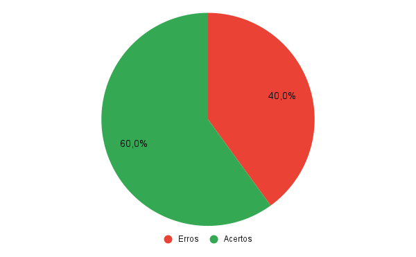
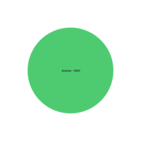

## 1. Introdução

&emsp;&emsp;Para verificar o a análise foward-from do projeto de Requisitos de software do aplicativo Noruh, usaremos a estratégia de "inspeções", seguindo o planejamento detalhado na página de [Planejamento da Verificação](../verificacao/planejamento.md)

## 2. Preparação

&emsp;&emsp;Neste documento, iremos fazer a avaliação da análise [foward-from](../../pos-rastreabilidade/forward-from.md). Para fazer a inspeção vamos utilizar um "checklist" com algumas perguntas com base nas referências utilizadas para a elaboração do artefato e os critérios de avaliação do artefato adotados na disciplina, dessa forma, podemos ver se o nosso está correto com base nessas perguntas. Quando o critério for atentido, terá um "check" confirmando e quando não estiver , terá um "X" dizendo que não está correto. Conforme a legenda abaixo:

- ✅ : Atendido
- ❌ : Não Atendido

&emsp;&emsp;Além disso, após identificarmos os erros presentes no artefato, iremos concertá-los, assim produzindo uma segunda versão do artefato e da checklist.

&emsp;&emsp;As checklists definidas podem ser encontradas a baixo:

|ID|Questão| Inspeção |
|-----------|-------------|-------------|
| 1 |São apresentados todos os artefatos que foram derivados do requisito? ||
| 2 |É apresentado o status de implementação do requisito?||
| 3 |É apresentada a história de usuário que representa o requisito? ||
| 4 |Foram colocados hyperlinks para os léxicos?||
| 5 |Cada requisito apresenta um vídeo demonstrando a funcionalidade implementada no app?||

<figcaption align='center'>
    <b>Tabela 1: Preparação checklist Backlog </b>
     <small> Fonte: Elaboração Própria </small>
</figcaption>

## 3. Inspeção Foward-From 
&emsp;&emsp;A checklist após inspeção da análise foward-from pode ser encontrado abaixo:

|ID|Questão| Inspeção |
|-----------|-------------|-------------|
| 1 |São apresentados todos os artefatos que foram derivados do requisito? |❌|
| 2 |É apresentado o status de implementação do requisito?|✅|
| 3 |É apresentada a história de usuário que representa o requisito? |✅|
| 4 |Foram colocados hyperlinks para os léxicos?|❌|
| 5 |Cada requisito apresenta um vídeo demonstrando a funcionalidade implementada no app?|✅|

<figcaption align='center'>
    <b>Tabela 2: Checklist Foward-From </b>
     <small> Fonte: Elaboração Própria </small>
</figcaption>

### 3.1 Resultados
&emsp;&emsp; Após a análise da checklist do backlog do produto verificamos que dos 4 critérios de avaliação nosso backlog cumpriu apenas 2 deles, assim gerando uma taxa de 50% de acertos. Como podemos ver pelo gráfico abaixo:

<figcaption align='center'>
    <b>Figura 1: Gráfico Inspeção Backlog </b>
     <small> Fonte: Elaboração Própria </small>
</figcaption>

&emsp;&emsp; Dessa forma com o objetivo de melhorarmos a qualidade do artefato, geramos uma segunda versão do mesmo cumprindo com os critérios da checklist.

### 3.2 Inspeção Foward-From Versão 2
&emsp;&emsp;A versão 2 da checklist com os critérios de avaliação pode ser encontrado abaixo:

|ID|Questão| Inspeção |
|-----------|-------------|-------------|
| 1 |São apresentados todos os artefatos que foram derivados do requisito? |✅|
| 2 |É apresentado o status de implementação do requisito?|✅|
| 3 |É apresentada a história de usuário que representa o requisito? |✅|
| 4 |Foram colocados hyperlinks para os léxicos?|✅|
| 5 |Cada requisito apresenta um vídeo demonstrando a funcionalidade implementada no app?|✅|

<figcaption align='center'>
    <b>Tabela 4: Checklist Foward-From V2 </b>
     <small> Fonte: Elaboração Própria </small>
</figcaption>

### 3.3 Resultados
&emsp;&emsp; Com esta segunda versão do Foward-From, cumprimos com 100% dos critérios da checklist. Como podemos ver com o gráfico abaixo:

<figcaption align='center'>
    <b>Figura 2: Gráfico Inspeção Foward-From Segunda Versão </b>
     <small> Fonte: Elaboração Própria </small>
</figcaption>

## Referências
- SERRANO, Maurício; SERRANO, Milene. Requisitos - Aula 23. 1º/2022. Material apresentado para a disciplina de Requisitos de Software no curso de Engenharia de Software da UnB, FGA.

## Histórico de versão
| Versão |      Alteração      | Responsável |           Revisor            |   Data   | Hora  |
| :----: | :-----------------: | :---------: | :--------------------------: | :------: | :------: |
|  1.0   |      Criação do documento          |    Lucas   |-               | 7/09/22 |15:00 às 16:00 |