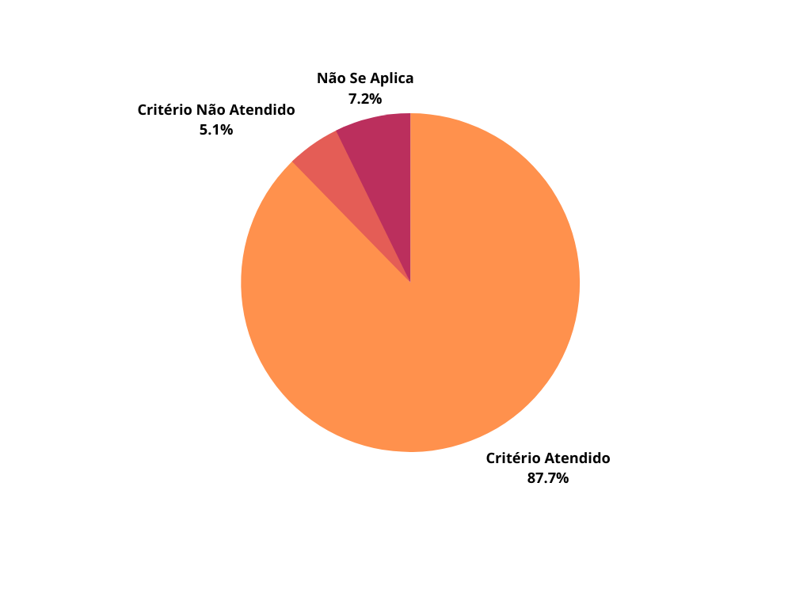
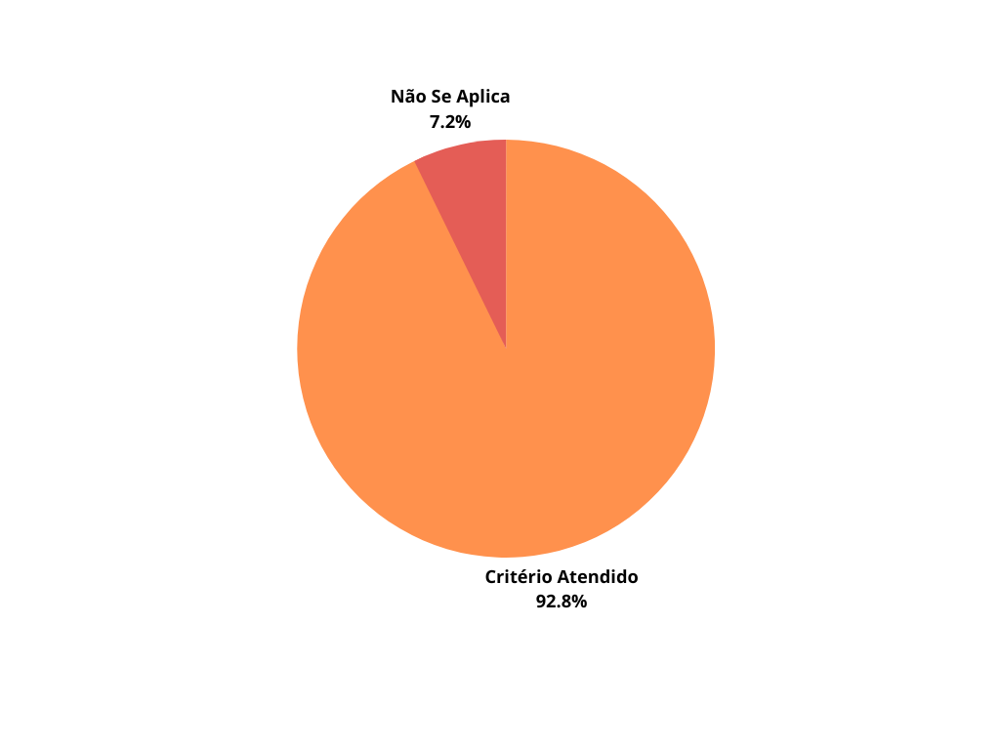

## 1. Introdução

&emsp;&emsp;Para verificar os léxicos do projeto de Requisitos de software do aplicativo Noruh, usaremos a estratégia de "inspeções", seguindo o planejamento detalhado na página de [Planejamento da Verificação](../verificacao/planejamento.md)

## 2. Metodologia

&emsp;&emsp;Para executar a inspeção, utilizaremos um "checklist" com algumas perguntas com base nas referências sobre cenários adotados na disciplina. Para o "checklist" utilizaremos o seguinte modelo:

- ✅ : Critério Atendido
- ❌ : Critério Não Atendido

&emsp;&emsp;Além disso, após identificarmos os erros presentes no artefato, iremos concertá-los, assim produzindo uma segunda versão do artefato e da checklist.

| Número |                                                      Crritérios                                                       | LXX |
| :----: | :-------------------------------------------------------------------------------------------------------------------: | :-: |
|   1    |                           O léxico possui nome, noção, classificação, impactos e sinônimos?                           |     |
|   2    |                                             Possui informações concisas?                                              |     |
|   3    |                          A noção do léxico está clara e define o que é símbolo (denotação)?                           |     |
|   4    |                                     Os símbolos estão devidamente classificados?                                      |     |
|   5    | Os impactos descrevem o efeito, uso ou coerência do símbolo no sitema ou efeito de algo na aplicação sobre o símbolo? |     |
|   6    |                                       Os sinônimos são compatíveis? (se houver)                                       |     |

<figcaption align='center'>
    <b>Tabela 1: Preparação Checklist Léxicos </b>
     <small> Fonte: Elaboração Própria </small>
</figcaption>

## 3. Checklist Léxicos Versão 1

- Legenda

|           Abreviação           |            Descrição             |
| :----------------------------: | :------------------------------: |
|       <strong>L</strong>       |              Léxico              |
|      <strong>XX</strong>       |            Numeração             |
|               ✅               |               Sim                |
|               ❌               |               Não                |
| <strong>Não se aplica</strong> | Critério não se aplica ao léxico |

| Número |                                                       Critérios                                                       | [L01](https://requisitos-de-software.github.io/2022.1-Noruh/modelagem/lexicos/#lexico-01) | [L02](https://requisitos-de-software.github.io/2022.1-Noruh/modelagem/lexicos/#lexico-02) | [L03](https://requisitos-de-software.github.io/2022.1-Noruh/modelagem/lexicos/#lexico-03) | [L04](https://requisitos-de-software.github.io/2022.1-Noruh/modelagem/lexicos/#lexico-04) | [L05](https://requisitos-de-software.github.io/2022.1-Noruh/modelagem/lexicos/#lexico-05) | [L06](https://requisitos-de-software.github.io/2022.1-Noruh/modelagem/lexicos/#lexico-06) | [L07](https://requisitos-de-software.github.io/2022.1-Noruh/modelagem/lexicos/#lexico-07) | [L08](https://requisitos-de-software.github.io/2022.1-Noruh/modelagem/lexicos/#lexico-08) | [L09](https://requisitos-de-software.github.io/2022.1-Noruh/modelagem/lexicos/#lexico-09) | [L10](https://requisitos-de-software.github.io/2022.1-Noruh/modelagem/lexicos/#lexico-10) | [L11](https://requisitos-de-software.github.io/2022.1-Noruh/modelagem/lexicos/#lexico-11) | [L12](https://requisitos-de-software.github.io/2022.1-Noruh/modelagem/lexicos/#lexico-12) | [L13](https://requisitos-de-software.github.io/2022.1-Noruh/modelagem/lexicos/#lexico-13) | [L14](https://requisitos-de-software.github.io/2022.1-Noruh/modelagem/lexicos/#lexico-14) | [L15](https://requisitos-de-software.github.io/2022.1-Noruh/modelagem/lexicos/#lexico-15) | [L16](https://requisitos-de-software.github.io/2022.1-Noruh/modelagem/lexicos/#lexico-16) | [L17](https://requisitos-de-software.github.io/2022.1-Noruh/modelagem/lexicos/#lexico-17) | [L18](https://requisitos-de-software.github.io/2022.1-Noruh/modelagem/lexicos/#lexico-18) | [L19](https://requisitos-de-software.github.io/2022.1-Noruh/modelagem/lexicos/#lexico-19) | [L20](https://requisitos-de-software.github.io/2022.1-Noruh/modelagem/lexicos/#lexico-20) | [L21](https://requisitos-de-software.github.io/2022.1-Noruh/modelagem/lexicos/#lexico-21) | [L22](https://requisitos-de-software.github.io/2022.1-Noruh/modelagem/lexicos/#lexico-22) | [L23](https://requisitos-de-software.github.io/2022.1-Noruh/modelagem/lexicos/#lexico-23) |
| :----: | :-------------------------------------------------------------------------------------------------------------------: | :---------------------------------------------------------------------------------------: | :---------------------------------------------------------------------------------------: | :---------------------------------------------------------------------------------------: | :---------------------------------------------------------------------------------------: | :---------------------------------------------------------------------------------------: | :---------------------------------------------------------------------------------------: | :---------------------------------------------------------------------------------------: | :---------------------------------------------------------------------------------------: | :---------------------------------------------------------------------------------------: | :---------------------------------------------------------------------------------------: | :---------------------------------------------------------------------------------------: | :---------------------------------------------------------------------------------------: | :---------------------------------------------------------------------------------------: | :---------------------------------------------------------------------------------------: | :---------------------------------------------------------------------------------------: | :---------------------------------------------------------------------------------------: | :---------------------------------------------------------------------------------------: | :---------------------------------------------------------------------------------------: | :---------------------------------------------------------------------------------------: | :---------------------------------------------------------------------------------------: | :---------------------------------------------------------------------------------------: | :---------------------------------------------------------------------------------------: | :---------------------------------------------------------------------------------------: |
|   1    |                           O léxico possui nome, noção, classificação, impactos e sinônimos?                           |                                            ✅                                             |                                            ✅                                             |                                            ✅                                             |                                            ✅                                             |                                            ✅                                             |                                            ✅                                             |                                            ✅                                             |                                            ✅                                             |                                            ✅                                             |                                            ✅                                             |                                            ✅                                             |                                            ✅                                             |                                            ✅                                             |                                            ✅                                             |                                            ✅                                             |                                            ✅                                             |                                            ✅                                             |                                            ✅                                             |                                            ✅                                             |                                            ✅                                             |                                            ✅                                             |                                            ✅                                             |                                            ✅                                             |
|   2    |                                             Possui informações concisas?                                              |                                            ✅                                             |                                            ✅                                             |                                            ✅                                             |                                            ❌                                             |                                            ✅                                             |                                            ✅                                             |                                            ✅                                             |                                            ✅                                             |                                            ✅                                             |                                            ✅                                             |                                            ✅                                             |                                            ✅                                             |                                            ✅                                             |                                            ✅                                             |                                            ✅                                             |                                            ✅                                             |                                            ✅                                             |                                            ✅                                             |                                            ✅                                             |                                            ❌                                             |                                            ✅                                             |                                            ✅                                             |                                            ✅                                             |
|   3    |                          A noção do léxico está clara e define o que é símbolo (denotação)?                           |                                            ✅                                             |                                            ✅                                             |                                            ✅                                             |                                            ❌                                             |                                            ✅                                             |                                            ✅                                             |                                            ✅                                             |                                            ✅                                             |                                            ✅                                             |                                            ✅                                             |                                            ✅                                             |                                            ✅                                             |                                            ✅                                             |                                            ✅                                             |                                            ✅                                             |                                            ✅                                             |                                            ✅                                             |                                            ✅                                             |                                            ✅                                             |                                            ❌                                             |                                            ✅                                             |                                            ✅                                             |                                            ✅                                             |
|   4    |                                     Os símbolos estão devidamente classificados?                                      |                                            ✅                                             |                                            ✅                                             |                                            ✅                                             |                                            ✅                                             |                                            ✅                                             |                                            ✅                                             |                                            ✅                                             |                                            ✅                                             |                                            ✅                                             |                                            ✅                                             |                                            ✅                                             |                                            ✅                                             |                                            ✅                                             |                                            ✅                                             |                                            ✅                                             |                                            ✅                                             |                                            ✅                                             |                                            ✅                                             |                                            ✅                                             |                                            ✅                                             |                                            ✅                                             |                                            ✅                                             |                                            ✅                                             |
|   5    | Os impactos descrevem o efeito, uso ou coerência do símbolo no sitema ou efeito de algo na aplicação sobre o símbolo? |                                            ✅                                             |                                            ✅                                             |                                            ✅                                             |                                            ✅                                             |                                            ✅                                             |                                            ✅                                             |                                            ✅                                             |                                            ✅                                             |                                            ✅                                             |                                            ✅                                             |                                            ✅                                             |                                            ✅                                             |                                            ✅                                             |                                            ✅                                             |                                            ✅                                             |                                            ✅                                             |                                            ✅                                             |                                            ✅                                             |                                            ✅                                             |                                            ✅                                             |                                            ✅                                             |                                            ✅                                             |                                            ✅                                             |
|   6    |                                       Os sinônimos são compatíveis? (se houver)                                       |                                       Não se aplica                                       |                                            ✅                                             |                                            ✅                                             |                                            ✅                                             |                                       Não se aplica                                       |                                       Não se aplica                                       |                                            ❌                                             |                                       Não se aplica                                       |                                       Não se aplica                                       |                                            ✅                                             |                                            ✅                                             |                                            ❌                                             |                                       Não se aplica                                       |                                            ✅                                             |                                       Não se aplica                                       |                                       Não se aplica                                       |                                            ✅                                             |                                            ❌                                             |                                            ✅                                             |                                            ✅                                             |                                       Não se aplica                                       |                                       Não se aplica                                       |                                            ✅                                             |

<figcaption align='center'>
    <b>Tabela 2: Checklist Léxicos Versão 1 </b>
     <small> Fonte:  Elaboração Própria </small>
</figcaption>

### 3.1 Melhorias

&emsp;&emsp;Após a análise da checlist do produto, verificamos que em alguns casos o léxico em questão não atendia algum critério em relação ao contexto ou o critério não se aplicava a ele, assim gerando uma taxa de aproximadamente 87,68% de acertos. Dessa forma com o objetivo de melhorarmos estes critérios, ajustamos e detalhamos o contexto de cada léxico em que o critério não foi atendido, e assim, gerando uma segunda versão do mesmo cumprindo com os cirtérios da checklist.

<figcaption align='center'>
    <b>Figura 1: Gráfico Verificação Léxicos </b>
     <small> Fonte: Elaboração Própria </small>
</figcaption>

### 3.2 Checklist Léxicos Versão 2

&emsp;&emsp;A versão 2 da checklist com os critérios de avaliação pode ser encontrado abaixo:

| Número |                                                       Critérios                                                       | [L01](https://requisitos-de-software.github.io/2022.1-Noruh/modelagem/lexicos/#lexico-01) | [L02](https://requisitos-de-software.github.io/2022.1-Noruh/modelagem/lexicos/#lexico-02) | [L03](https://requisitos-de-software.github.io/2022.1-Noruh/modelagem/lexicos/#lexico-03) | [L04](https://requisitos-de-software.github.io/2022.1-Noruh/modelagem/lexicos/#lexico-04) | [L05](https://requisitos-de-software.github.io/2022.1-Noruh/modelagem/lexicos/#lexico-05) | [L06](https://requisitos-de-software.github.io/2022.1-Noruh/modelagem/lexicos/#lexico-06) | [L07](https://requisitos-de-software.github.io/2022.1-Noruh/modelagem/lexicos/#lexico-07) | [L08](https://requisitos-de-software.github.io/2022.1-Noruh/modelagem/lexicos/#lexico-08) | [L09](https://requisitos-de-software.github.io/2022.1-Noruh/modelagem/lexicos/#lexico-09) | [L10](https://requisitos-de-software.github.io/2022.1-Noruh/modelagem/lexicos/#lexico-10) | [L11](https://requisitos-de-software.github.io/2022.1-Noruh/modelagem/lexicos/#lexico-11) | [L12](https://requisitos-de-software.github.io/2022.1-Noruh/modelagem/lexicos/#lexico-12) | [L13](https://requisitos-de-software.github.io/2022.1-Noruh/modelagem/lexicos/#lexico-13) | [L14](https://requisitos-de-software.github.io/2022.1-Noruh/modelagem/lexicos/#lexico-14) | [L15](https://requisitos-de-software.github.io/2022.1-Noruh/modelagem/lexicos/#lexico-15) | [L16](https://requisitos-de-software.github.io/2022.1-Noruh/modelagem/lexicos/#lexico-16) | [L17](https://requisitos-de-software.github.io/2022.1-Noruh/modelagem/lexicos/#lexico-17) | [L18](https://requisitos-de-software.github.io/2022.1-Noruh/modelagem/lexicos/#lexico-18) | [L19](https://requisitos-de-software.github.io/2022.1-Noruh/modelagem/lexicos/#lexico-19) | [L20](https://requisitos-de-software.github.io/2022.1-Noruh/modelagem/lexicos/#lexico-20) | [L21](https://requisitos-de-software.github.io/2022.1-Noruh/modelagem/lexicos/#lexico-21) | [L22](https://requisitos-de-software.github.io/2022.1-Noruh/modelagem/lexicos/#lexico-22) | [L23](https://requisitos-de-software.github.io/2022.1-Noruh/modelagem/lexicos/#lexico-23) |
| :----: | :-------------------------------------------------------------------------------------------------------------------: | :---------------------------------------------------------------------------------------: | :---------------------------------------------------------------------------------------: | :---------------------------------------------------------------------------------------: | :---------------------------------------------------------------------------------------: | :---------------------------------------------------------------------------------------: | :---------------------------------------------------------------------------------------: | :---------------------------------------------------------------------------------------: | :---------------------------------------------------------------------------------------: | :---------------------------------------------------------------------------------------: | :---------------------------------------------------------------------------------------: | :---------------------------------------------------------------------------------------: | :---------------------------------------------------------------------------------------: | :---------------------------------------------------------------------------------------: | :---------------------------------------------------------------------------------------: | :---------------------------------------------------------------------------------------: | :---------------------------------------------------------------------------------------: | :---------------------------------------------------------------------------------------: | :---------------------------------------------------------------------------------------: | :---------------------------------------------------------------------------------------: | :---------------------------------------------------------------------------------------: | :---------------------------------------------------------------------------------------: | :---------------------------------------------------------------------------------------: | :---------------------------------------------------------------------------------------: |
|   1    |                           O léxico possui nome, noção, classificação, impactos e sinônimos?                           |                                            ✅                                             |                                            ✅                                             |                                            ✅                                             |                                            ✅                                             |                                            ✅                                             |                                            ✅                                             |                                            ✅                                             |                                            ✅                                             |                                            ✅                                             |                                            ✅                                             |                                            ✅                                             |                                            ✅                                             |                                            ✅                                             |                                            ✅                                             |                                            ✅                                             |                                            ✅                                             |                                            ✅                                             |                                            ✅                                             |                                            ✅                                             |                                            ✅                                             |                                            ✅                                             |                                            ✅                                             |                                            ✅                                             |
|   2    |                                             Possui informações concisas?                                              |                                            ✅                                             |                                            ✅                                             |                                            ✅                                             |                                            ✅                                             |                                            ✅                                             |                                            ✅                                             |                                            ✅                                             |                                            ✅                                             |                                            ✅                                             |                                            ✅                                             |                                            ✅                                             |                                            ✅                                             |                                            ✅                                             |                                            ✅                                             |                                            ✅                                             |                                            ✅                                             |                                            ✅                                             |                                            ✅                                             |                                            ✅                                             |                                            ✅                                             |                                            ✅                                             |                                            ✅                                             |                                            ✅                                             |
|   3    |                          A noção do léxico está clara e define o que é símbolo (denotação)?                           |                                            ✅                                             |                                            ✅                                             |                                            ✅                                             |                                            ✅                                             |                                            ✅                                             |                                            ✅                                             |                                            ✅                                             |                                            ✅                                             |                                            ✅                                             |                                            ✅                                             |                                            ✅                                             |                                            ✅                                             |                                            ✅                                             |                                            ✅                                             |                                            ✅                                             |                                            ✅                                             |                                            ✅                                             |                                            ✅                                             |                                            ✅                                             |                                            ✅                                             |                                            ✅                                             |                                            ✅                                             |                                            ✅                                             |
|   4    |                                     Os símbolos estão devidamente classificados?                                      |                                            ✅                                             |                                            ✅                                             |                                            ✅                                             |                                            ✅                                             |                                            ✅                                             |                                            ✅                                             |                                            ✅                                             |                                            ✅                                             |                                            ✅                                             |                                            ✅                                             |                                            ✅                                             |                                            ✅                                             |                                            ✅                                             |                                            ✅                                             |                                            ✅                                             |                                            ✅                                             |                                            ✅                                             |                                            ✅                                             |                                            ✅                                             |                                            ✅                                             |                                            ✅                                             |                                            ✅                                             |                                            ✅                                             |
|   5    | Os impactos descrevem o efeito, uso ou coerência do símbolo no sitema ou efeito de algo na aplicação sobre o símbolo? |                                            ✅                                             |                                            ✅                                             |                                            ✅                                             |                                            ✅                                             |                                            ✅                                             |                                            ✅                                             |                                            ✅                                             |                                            ✅                                             |                                            ✅                                             |                                            ✅                                             |                                            ✅                                             |                                            ✅                                             |                                            ✅                                             |                                            ✅                                             |                                            ✅                                             |                                            ✅                                             |                                            ✅                                             |                                            ✅                                             |                                            ✅                                             |                                            ✅                                             |                                            ✅                                             |                                            ✅                                             |                                            ✅                                             |
|   6    |                                       Os sinônimos são compatíveis? (se houver)                                       |                                       Não se aplica                                       |                                            ✅                                             |                                            ✅                                             |                                            ✅                                             |                                       Não se aplica                                       |                                       Não se aplica                                       |                                            ✅                                             |                                       Não se aplica                                       |                                       Não se aplica                                       |                                            ✅                                             |                                            ✅                                             |                                            ✅                                             |                                       Não se aplica                                       |                                            ✅                                             |                                       Não se aplica                                       |                                       Não se aplica                                       |                                            ✅                                             |                                            ✅                                             |                                            ✅                                             |                                            ✅                                             |                                       Não se aplica                                       |                                       Não se aplica                                       |                                            ✅                                             |

<figcaption align='center'>
    <b>Tabela 3: Checklist Léxicos Versão 2 </b>
     <small> Fonte:  Elaboração Própria </small>
</figcaption>

### 3.3 Resultados

&emsp;&emsp;Com a segunda versão do checklist, cumprimos 92,8% dos critérios da checklist, e 7,2% não se aplica, como é demonstrado no gráfico abaixo:

<figcaption align='center'>
    <b>Figura 2: Gráfico Verificação Léxicos Versão 2 </b>
     <small> Fonte: Elaboração Própria </small>
</figcaption>

## Referências

- SERRANO, Maurício; SERRANO, Milene. Requisitos - Aula 23. 1º/2022. Material apresentado para a disciplina de Requisitos de Software no curso de Engenharia de Software da UnB, FGA.

## Histórico de versão

| Versão |             Alteração              | Responsável |    Revisor    |   Data   |      Hora      |
| :----: | :--------------------------------: | :---------: | :-----------: | :------: | :------------: |
|  1.0   |        Criação do documento        |    Bruno    |     Lucas     | 16/08/22 | 19:00 às 19:55 |
|  1.1   |         Documento revisado         |    Lucas    |       -       | 17/08/22 | 22:30 às 23:00 |
|  2.0   | Adicionando hyperlinks dos léxicos |    Bruno    | João Henrique | 29/08/22 | 10:30 às 10:50 |
