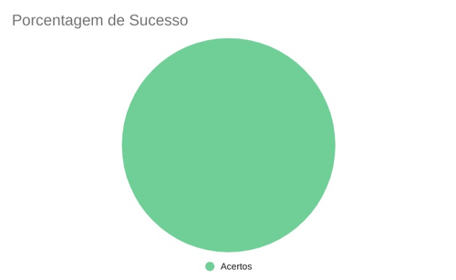

## 1. Introdução

&emsp;&emsp;Para verificar os Casos de Uso do projeto de Requisitos de software do aplicativo Noruh, usaremos a estratégia de "inspeções", no qual se objetiva o descobrimento de defeitos em documentos, buscando assim achar os defeitos no documento de [NFR Framework](../../modelagem/nfrframework.md).

## 2. Preparação

&emsp;&emsp;Baseado na metodologia adotada no [Planejamento da Verificação](planejamento.md), a preparação, inspeção e acompanhamento da verificação serão feitos a partir de um *checklist* com algumas perguntas com base nas referências sobre NFR Framework citadas nessa página que mostram como fazer um NFR Framework, dessa forma, podemos ver se o nosso está correto com base nessas perguntas. Quando estiver correto, terá um "check" confirmando e quando estiver errado, terá um "X" dizendo que não está correto. Conforme a legenda abaixo:

- ✅ : Atendido
- ❌ : Não Atendido

&emsp;&emsp;A checklist a ser seguida encontra-se abaixo na Tabela 1.

| ID | Questão |
|-----------|-------------|
| 1 | Os softgoals condizem com o contexto? |
| 2 | Os softgoals apresentam metas bem definidas? | 
| 3 | Os impactos foram corretamente propagados? |
| 4 | Há explicação dos elementos? |
| 5 | Os elementos são utilizados de forma correta? |
| 6 | Os caminhos dos softgoals são coerentes? |
| 7 | Os diagramas representam os requisitos não-funcionais corretamente? |
| 8 | A redundância foi evitada? |

<figcaption align='center'>
    <b>Tabela 1: Modelo de checklist</b>
     <small> Fonte: Elaboração Própria </small>
</figcaption>

## 3. Inspeção: Checklist do NFR Framework

| ID | Questão | Inspeção |
|-----------|-------------|-------------|
| 1 | Os softgoals condizem com o contexto? | ✅ |
| 2 | Os softgoals apresentam metas bem definidas? | ✅ |
| 3 | Os impactos foram corretamente propagados? | ✅ |
| 4 | Há explicação dos elementos? | ✅ |
| 5 | Os elementos são utilizados de forma correta? | ✅ |
| 6 | Os caminhos dos softgoals são coerentes? | ✅ |
| 7 | Os diagramas representam os requisitos não-funcionais corretamente? | ✅ |
| 8 | A redundância foi evitada? | ✅ |

<figcaption align='center'>
    <b>Tabela 2: Checklist do NFR Framework </b>
     <small> Fonte: Elaboração Própria </small>
</figcaption>

#### 3.1 Acompanhamento: Porcentagem de sucesso do checklist
- 0 ERROS e 8 ACERTOS
- 100% de acertos

<figcaption align='center'>
    <b>Gráfico 1: Porcentagem de sucesso do checklist do NFR Framework </b>
     <small> Fonte: Elaboração Própria </small>
</figcaption>

## 4. Correção

&emsp;&emsp;Após a inspeção do NFR Framework de acordo com o checklist feito com base nas referências citadas abaixo nesse documento, o artefato não apresenta erros e não será necessário nenhuma mudança, sendo assim não exige nenhuma correção até o presente momento.

## Referências
- SERRANO, Maurício; SERRANO, Milene. Requisitos - Aula 23. 1º/2022. Material apresentado para a disciplina de Requisitos de Software no curso de Engenharia de Software da UnB, FGA.
- SERRANO, Maurício; SERRANO, Milene. Requisitos - Aula 17. 1º/2022. Material apresentado para a disciplina de Requisitos de Software no curso de Engenharia de Software da UnB, FGA.

## Histórico de versão
| Versão |      Alteração      | Responsável |           Revisor            |   Data   | 
| :----: | :-----------------: | :---------: | :--------------------------: | :------: | 
|  1.0   |      Criação do documento          |    Karla   |       -        | 15/08/22 |
