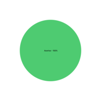

## 1. Introdução

&emsp;&emsp;Para verificar as Personas do projeto de Requisitos de software do aplicativo Noruh, usaremos a estratégia de "inspeções", seguindo o planejamento detalhado na página de [Planejamento da Verificação](../verificacao/planejamento.md)

## 2. Preparação

&emsp;&emsp;Neste documento, iremos fazer a avaliação das [Personas](../../elicitacao/personas.md). Para fazer a inspeção vamos utilizar um "checklist" com algumas perguntas com base nas referências utilizadas para a elaboração do artefato e os critérios de avaliação do artefato adotados na disciplina, dessa forma, podemos ver se o nosso está correto com base nessas perguntas. Quando o critério for atentido, terá um "check" confirmando e quando não estiver , terá um "X" dizendo que não está correto. Conforme a legenda abaixo:

- ✅ : Atendido
- ❌ : Não Atendido

&emsp;&emsp;Além disso, após identificarmos os erros presentes no artefato, iremos concertá-los, assim produzindo uma segunda versão do artefato e da checklist.

&emsp;&emsp;As checklists definidas podem ser encontradas a baixo:

|ID|Questão| Inspeção |
|-----------|-------------|-------------|
| 1 | Possui personas baseadas no Perfil de Usuário e suas características? ||
| 2 | Foram especifícadas quantas personas seriam definidas e a motivação deste número? ||
| 3 | Foi definida uma antipersona? ||
| 4 | As personas descrevem um usuário típico? ||
| 5 | Foram definidos os objetivos das personas? ||
| 6 | Foram definidos os status das personas? ||
| 7 | Foram definidas tarefas que as personas realizam no sistema? ||

<figcaption align='center'>
    <b>Tabela 1: Preparação checklist Personas </b>
     <small> Fonte: Elaboração Própria </small>
</figcaption>

## 3. Inspeção Personas

&emsp;&emsp;A checklist após inspeção da [versão 1 das Personas](../../elicitacao/personasV1.md) pode ser encontrado abaixo:

|ID|Questão| Inspeção |
|-----------|-------------|-------------|
| 1 | Possui personas baseadas no Perfil de Usuário e suas características? |❌|
| 2 | Foram especifícadas quantas personas seriam definidas e a motivação deste número? |✅|
| 3 | Foi definida uma antipersona? |✅|
| 4 | As personas descrevem um usuário típico? |❌|
| 5 | Foram definidos os objetivos das personas? |❌|
| 6 | Foram definidos os status das personas? |✅|
| 7 | Foram definidas tarefas que as personas realizam no sistema? |❌|

<figcaption align='center'>
    <b>Tabela 2: Checklist Inspeção Personas </b>
     <small> Fonte: Elaboração Própria </small>
</figcaption>

### 3.1 Resultados
&emsp;&emsp; Após a análise da checklist das personas verificamos que dos 7 critérios de avaliação definidos, foram cumpridos apenas 3 deles, assim gerando uma taxa de aproximadamente 40% de acertos. Como podemos ver pelo gráfico abaixo:

<figcaption align='center'>
    <b>Figura 1: Gráfico Inspeção Backlog </b>
     <small> Fonte: Elaboração Própria </small>
</figcaption>

&emsp;&emsp; Dessa forma com o objetivo de melhorarmos a qualidade do artefato, geramos uma segunda versão do mesmo cumprindo com os critérios da checklist.

## 4 Inspeção Personas Versão 2
&emsp;&emsp;A versão 2 da checklist com os critérios de avaliação pode ser encontrado abaixo:

|ID|Questão| Inspeção |
|-----------|-------------|-------------|
| 1 | Possui personas baseadas no Perfil de Usuário e suas características? |✅|
| 2 | Foram especifícadas quantas personas seriam definidas e a motivação deste número? |✅|
| 3 | Foi definida uma antipersona? |✅|
| 4 | As personas descrevem um usuário típico? |✅|
| 5 | Foram definidos os objetivos das personas? |✅|
| 6 | Foram definidos os status das personas? |✅|
| 7 | Foram definidas tarefas que as personas realizam no sistema? |✅|

<figcaption align='center'>
    <b>Tabela 3: Checklist Personas V2 </b>
     <small> Fonte: Elaboração Própria </small>
</figcaption>

### 4.1 Resultados
&emsp;&emsp; Com esta segunda versão do artefato de Personas, cumprimos com 100% dos critérios da checklist. Como podemos ver com o gráfico abaixo:

<figcaption align='center'>
    <b>Figura 2: Gráfico Inspeção Personas Segunda Versão </b>
     <small> Fonte: Elaboração Própria </small>
</figcaption>

## Referências
- BARBOSA, Simone; SILVA, Bruno. Interação Humano Computador. Rio de Janeiro. Elsevier Editora Ltda. 2010

- Aula 13 – Atividade de Conteúdo ( Individual): Resumo da aula 11: " Apresentação do projeto etapa 3: Elicitação de Requisito: Técnicas, Priorização, Personas"

## Histórico de versão
| Versão |      Alteração      | Responsável |           Revisor            |   Data   | Hora  |
| :----: | :-----------------: | :---------: | :--------------------------: | :------: | :------: |
|  1.0   |      Criação do documento          |    Lucas   |         João       | 14/08/22 |18:00 às 20:35 |

