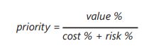

# First Things First

## 1. Introdução
&emsp;&emsp; Como definido por Wiegers e Beatty (2013), a técnica de priorização First Things First possui uma abordagem mais analítica, e é útil quando a equipe de desenvolvimento e os stakeholders não conseguem chegar à um consenso quanto a prioridade dos requisitos utilizando outras técnicas mais informais. Sendo assim, esta técnica utiliza de um modelo matemático para calcular a prioridade de cada requisito, e o passo a passo deste modelo pode ser dividido da seguinte forma:

- **1 Passo**: A equipe lista os requisitos que serão priorizados
- **2 Passo**: Stakeholders estimam o benefício que cada funcionalidade trará em uma escala de 1 a 9
- **3 Passo**: Stakeholders estimam a penalidade que cada funcionalidade causará se não for implementada, também em uma escala de 1 a 9
- **4 Passo**: É calculado o Valor Total de cada funcionalidade, que consiste na soma dos benefícios e penalidades, levando em consideração o peso de cada uma. Além disso é calculado o Valor% que é baseado na soma dos valores de todas as features
- **5 Passo**: Os desenvolvedores estimam o custo relativo de implementar cada funcionalidade em uma escala de 1 a 9
- **6 Passo**: Os desenvolvedores o risco técnico de implementação de cada funcionalidade, também em uma escala de 1 a 9
- **7 Passo**: É calculado o valor da prioridade de cada requisito utilizando a seguinte fórmula:

<figcaption align='center'>
    <b>Figura 1: Fórmula calculo prioridade</b>
     <small>Fonte: Software Requirements. Microsoft Press.</small>
</figcaption>

- **8 Passo**: Ordenar a lista em ordem decrescente da prioridade calculada.

## 2. Metodologia
&emsp;&emsp; Para a realização desta priorização coletamos os requisitos que foram avaliados como Should e Could durante a priorização [MoSCoW](../priorizacao/moscow.md), pois como dito por Wiegers e Beatty (2013) não é necessário incluir os requisitos que são prioridades óbvias, como os definidos como Must. E também, optamos por utilizar peso 2 nas estimativas geradas pelos stakeholders pois como neste trabalho não iremos codificar o app, julgamos que as etimativas de custo e risco sejam menos significativas para a priorização dos requisitos.

&emsp;&emsp; Além disso, para os passos em que é necessária a participação dos stakeholders, utilizamos a técnica de Role-Playing, onde o membro do grupo João Henrique interpretou a persona Rafael Henrique. 

&emsp;&emsp; Por fim, utilizamos uma tabela no Excel para nos ajudar com a parte matemática da priorização e ela pode ser encontrada a pelo [link](https://unbbr-my.sharepoint.com/:x:/g/personal/190016663_aluno_unb_br/Eewa56qQvmlKkxxnYT0aSWsB42bI80f0CN3dTZkxCglL8g?e=q322j3)

## 3. Priorização
&emsp;&emsp; O vídeo da reunião em que foi feita a priorização pode ser encontrado abaixo:

## 4. Resultados
&emsp;&emsp; Os resultados a gerados a partir da priorização estão representados na seguinte tabela:

| Códigos das Funcionalidades | Benefício Relativo | Penalidade relativa | Valor Total | Valor % | Custo Relativo | Custo % | Risco Relativo | Risco % | Prioridade |
| :-------------------------: | :----------------: | :-----------------: | :---------: | :-----: | :------------: | :-----: | :------------: | :-----: | :--------: |
| [BS04](../tecnicas/brainstorm/#4-resultados)  |      |     |      |   |               |    |               |   |      |
| [BS06](../tecnicas/brainstorm/#4-resultados)  |      |     |      |   |               |    |               |   |      |
| [BS08](../tecnicas/brainstorm/#4-resultados)  |      |     |      |   |               |    |               |   |      |
| [BS09](../tecnicas/brainstorm/#4-resultados)  |      |     |      |   |               |    |               |   |      |
| [BS10](../tecnicas/brainstorm/#4-resultados)  |      |     |      |   |               |    |               |   |      |
| [BS11](../tecnicas/brainstorm/#4-resultados) |      |     |      |   |               |    |               |   |      |
| [BS13](../tecnicas/brainstorm/#4-resultados) |      |     |      |   |               |    |               |   |      |
| [BS14](../tecnicas/brainstorm/#4-resultados) |      |     |      |   |               |    |               |   |      |
| [BS15](../tecnicas/brainstorm/#4-resultados) |      |     |      |   |               |    |               |   |      |
| [BS16](../tecnicas/brainstorm/#4-resultados) |      |     |      |   |               |    |               |   |      |
| [BS18](../tecnicas/brainstorm/#4-resultados) |      |     |      |   |               |    |               |   |      |
| [BS21](../tecnicas/brainstorm/#4-resultados) |      |     |      |   |               |    |               |   |      |
| [OBS02](../tecnicas/observacao/#4-resultados) |      |     |      |   |               |    |               |   |      |
| [OBS05](../tecnicas/observacao/#4-resultados) |      |     |      |   |               |    |               |   |      |
| [OBS06](../tecnicas/observacao/#4-resultados) |      |     |      |   |               |    |               |   |      |
| [OBS07](../tecnicas/observacao/#4-resultados) |      |     |      |   |               |    |               |   |      |
| [OBS08](../tecnicas/observacao/#4-resultados) |      |     |      |   |               |    |               |   |      |
| [OBS09](../tecnicas/observacao/#4-resultados) |      |     |      |   |               |    |               |   |      |
| [OBS10](../tecnicas/observacao/#4-resultados) |      |     |      |   |               |    |               |   |      |
| [Q06](../tecnicas/questionario/#4-resultado) |      |     |      |   |               |    |               |   |      |

<figcaption align='center'>
    <b>Tabela 1: Resultados da priorização</b>
     <small>Fonte: Software Requirements. Microsoft Press.</small>
</figcaption>

## 4. Histórico de Versão

| Versão |       Alteração       | Responsável | Revisor |    Data    |      Hora      |
| :----: | :-------------------: | :---------: | :-----: | :--------: | :------------: |
|  1.0   | Adiciona introdução, metodologia e monta tabela |    Lucas    |      João  |  31/08/22  | 16:00 às 18:00  |
|  1.1   | Gravação e executação da técnica  |    Lucas e João    |     Eurico    |  31/08/22  | 18:00 às 19:00  |
|  1.2   |   |   João    |     Eurico    |  31/08/22  | 19:00 às 19:00  |

## 5. Referências

- Wiegers, K.; Beatty, J. Software Requirements. Microsoft Press. ed. 3, 2013.