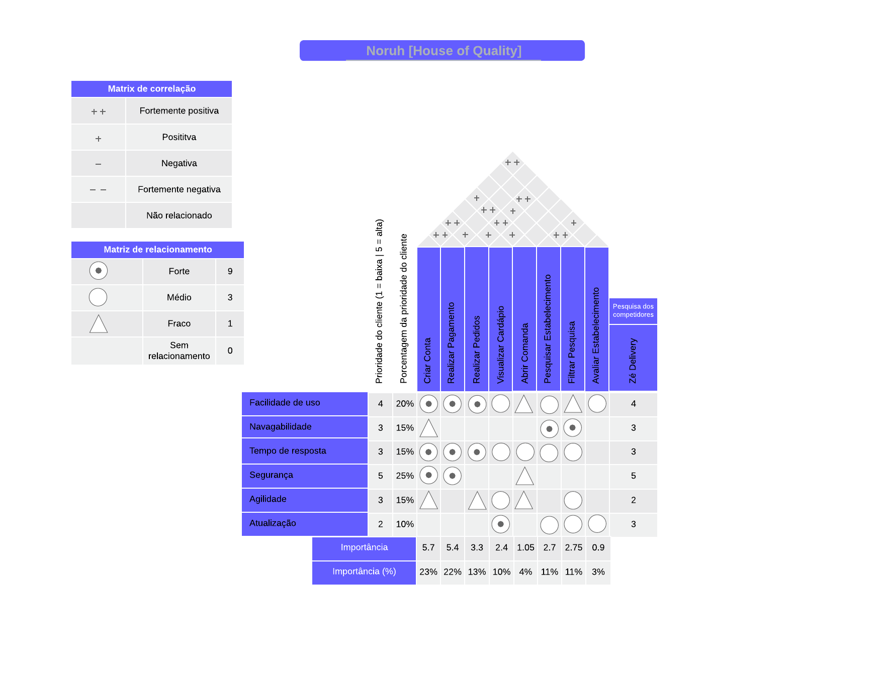

# House of Quality

## 1. Introdução

&emsp;&emsp;O desenvolvimento de um software visa sempre atender a necessidade do cliente, mas identificar o que o cliente realmente precisa é o mais difícil. Sem entender de forma plena quais são os pontos críticos e problemáticos do cliente, o processo de desenvolvimento pode acabar mal orientado e fadado ao fracasso desde o começo. Para resolver essa problemática, utilizamos da técnica House of quality.

&emsp;&emsp; A técnica de priorização House of quality traz voz a necessidade do cliente, incluindo pesquisa de concorrentes e o nível de importância de cada necessidade do cliente, a partir desses pontos conseguimos definir quais pontos têm prioridade.

## 2. Metodologia

&emsp;&emsp; Para construirmos o diagrama usando a técnica House of quality, nos baseamos no modelo do site LucidChart [1]. Foram levantados as necessidades mais importantes para o usuário, os requisitos de design e a prioridade de cada item dada pelo cliente. Após a estrutura inicial, partimos para a alocação dos pesos entre as necessidades do cliente e os requisitos de design. Por fim, foi feita uma pesquisa entre os concorrentes, e esses dados estão na parte da direita da tabela.

## 3. Priorização

&emsp;&emsp; Para a construção do House of Quality, foi utilizado uma priorização entre 1 e 5 para cada um dos requisitos listados à esquerda da tabela. Na parte superior da matriz de relacionamento, foram adicionados alguns requisitos do produto, e a partir disso a matriz de relacionamento foi preenchida de acordo com a legenda de matriz de relacionamento. Depois de preencher toda a matriz, foi utilizado um cálculo para obter a classificação de importância, onde a classificação de importância do cliente é multiplicada pela pontuação de relacionamento, e por fim os valores totais são somados.
Por fim, a matriz de correlação foi preenchida, na parte superior, logo acima dos requisitos listados. Para cada requisito foi determinado a correlação dos requisitos de acordo com a legenda.

### 3.1. House of quality

&emsp;&emsp; Após seguir os passos para a construção do House of Quality, chegamos à seguinte matriz:

<figcaption align='center'>
    <b>Figura 1: House of Quality - Noruh</b>
     <small>Fonte: Elaboração Própria </small>
</figcaption>

## 4. Histórico de Versão

| Versão |                            Alteração                            | Responsável | Revisor |   Data   |      Hora      |
| :----: | :-------------------------------------------------------------: | :---------: | :-----: | :------: | :------------: |
|  1.0   | Criação do documento e adição dos tópicos a serem desenvolvidos |   Eurico    |  João   | 01/09/22 | 15:00 às 15:15 |
|  1.1   |              Adição da introdução e da metodologia              |   Eurico    |  Bruno  | 01/09/22 | 16:00 às 17:30 |
|  1.2   |           Adição da priorização e do house of quality           |    Bruno    | Eurico  | 02/09/22 | 10:00 às 12:10 |

## 5. Referências

- John R. Hauser and Don Clausing. The House of Quality. Disponível em: https://hbr.org/1988/05/the-house-of-quality. Acesso em: 01/09/22
- How to Build a House of Quality (QFD). Disponível em: https://www.lucidchart.com/blog/qfd-house-of-quality. Acesso em: 01/09/22
