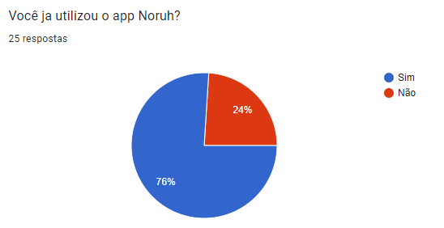
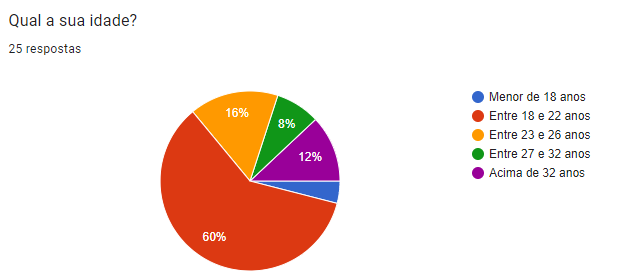
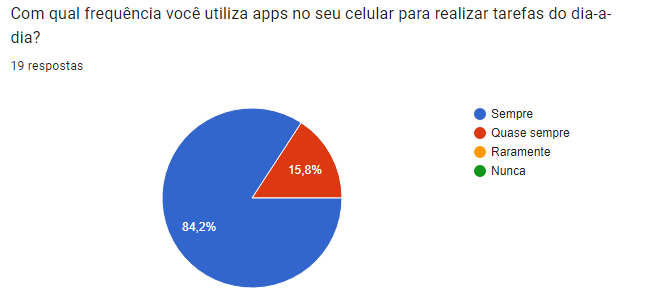
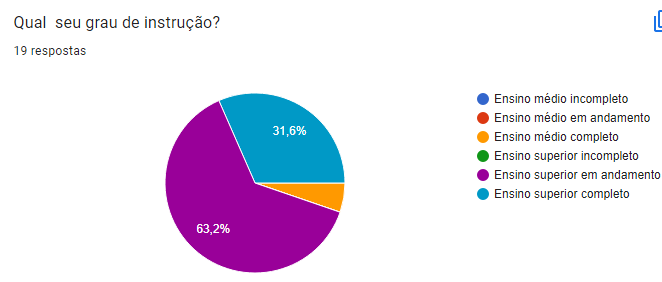
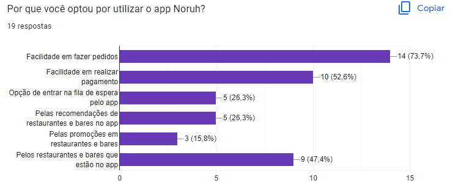
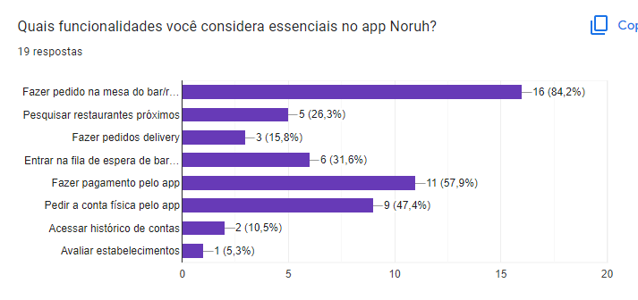
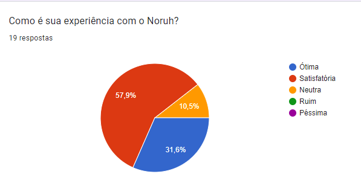
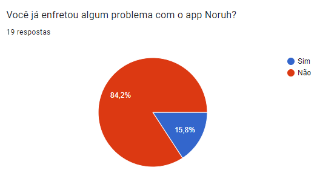

# Questionário

## 1. Introdução

&emsp;&emsp; Para a técnica de elicitação de questionário, utilizamos o google forms e fizemos um questionário com algumas perguntas sobre o aplicativo para as pessoas questionadas sobre o assunto, que enviamos via whatsapp em grupos pedindo as respostas de quem pudesse nos ajudar nessa pesquisa.

## 2. Metodologia

&emsp;&emsp; Utilizamos o questionário feito pelo Google Forms, e os enviamos para as pessoas através do whatsapp, e esperamos por dois dias para fazer a análise, e conseguimos 25 respostas, talvez pelo aplicativo não ser muito conhecido.

## 3. Questões

### Questão 1

<figcaption align='center'>
    <b>Figura 1: Pergunta 1</b>
     <small>Fonte: Elaboração Própria</small>
</figcaption>

&emsp;&emsp; Para iniciarmos o questionário, perguntamos ao usuário se ele já havia usado alguma vez o app Noruh. Para que dessa forma, pudessemos filtrar as repostas de usuários que nunca tiveram contato com app, direcionando-os ao fim do questionário após coletarmos sua idade.

### Questão 2

<figcaption align='center'>
    <b>Figura 2: Pergunta 2</b>
     <small>Fonte: Elaboração Própria</small>
</figcaption>

&emsp;&emsp; Na segunda pergunta tinhamos como objetivo saber qual a idade dos usuários. E com ela, pudemos confirmar que o app é mais popular entre jovens de 18 a 22 anos.

### Questão 3

<figcaption align='center'>
    <b>Figura 3: Pergunta 3</b>
     <small>Fonte: Elaboração Própria</small>
</figcaption>

&emsp;&emsp; Com a terceira pergunta tinhamos o objetivo de saber a familiaridade com tecnologia que os usuários do app possuiam.

### Questão 4

<figcaption align='center'>
    <b>Figura 4: Pergunta 4</b>
     <small>Fonte: Elaboração Própria</small>
</figcaption>

&emsp;&emsp; Com a quarta pergunta tinhamos o objetivo de o grau de instrução dos usuários, para que dessa forma pudessemos juntar informações o suficiente para criar o perfil de usuário.

### Questão 5

<figcaption align='center'>
    <b>Figura 5: Pergunta 5</b>
     <small>Fonte: Elaboração Própria</small>
</figcaption>

&emsp;&emsp; Com a quinta questão, filtramos requisitos de grande importância para os usuários, que fizeram com que eles usassem o app. Dessa maneira, concluímos que a facilidade em fazer pedidos e realizar pagamentos se destacaram entre os clientes.

### Questão 6

<figcaption align='center'>
    <b>Figura 6: Pergunta 6</b>
     <small>Fonte: Elaboração Própria</small>
</figcaption>
&emsp;&emsp; Nessa sexta questão, buscamos descobrir a frequência que os usuários utilizam o Noruh, e descobrimos que a maioria quase nunca usa

### Questão 7

<figcaption align='center'>
    <b>Figura 7: Pergunta 7</b>
     <small>Fonte: Elaboração Própria</small>
</figcaption>

&emsp;&emsp; Com a sétima questão, buscamos encontrar o grau de importância de algumas das funcionalidades para os usuários do app. Com isso, as funcionalidades de fazer o pedido na mesa, fazer pagamento pelo app e pedir a conta física pelo app se mostraram como as mais importantes nas visões dos usuários

### Questão 8

<figcaption align='center'>
    <b>Figura 8: Pergunta 8</b>
     <small>Fonte: Elaboração Própria</small>
</figcaption>

&emsp;&emsp;Nessa oitava questão buscamos descobrir qual o grau de experiência do usuário com o aplicativo, e descobrimos que a maioria diz que é satisfatória.

### Questão 9

<figcaption align='center'>
    <b>Figura 9: Pergunta 9</b>
     <small>Fonte: Elaboração Própria</small>
</figcaption>

&emsp;&emsp; Nessa nona questão tinhamos o objetivo de descobrir se o usuário já teve algum problema com o aplicativo, e a maioria diz que não.

### Questão 10

<figcaption align='center'>
    <b>Figura 10: Pergunta 10</b>
     <small>Fonte: Elaboração Própria</small>
</figcaption>

&emsp;&emsp; Com a décima questão, buscamos que o usuário nos informe qual foi o problema que ele teve com o aplicativo, e descobrimos que o mais informado foi o tempo de resposta do aplicativo.

### Questão 11

<figcaption align='center'>
    <b>Figura 11: Pergunta 11</b>
     <small>Fonte: Elaboração Própria</small>
</figcaption>

&emsp;&emsp; Por fim decidimos analisar o grau de satisfação do usuário com a interface gráfica do aplicativo.

## 4. Resultado

&emsp;&emsp; Com a análise desse questionário, podemos ver que as pessoas entrevistadas tiveram um alto grau de satisfação com o app, com poucos problemas, porém podemos analisar também, que o aplicativo não é muito conhecido pelas pessoas, pelo baixo número de resultados, e que ele tem potencial para alcançar muitas pessoas pelas suas funcionalidades.

&emsp;&emsp; Dessa forma, a partir das respostas do questionário conseguimos elicitar os seguintes requisitos:

| ID  | Descrição                                                                               | Tipo de Requisito |
| --- | --------------------------------------------------------------------------------------- | ----------------- |
| Q01 | O usuário deve conseguir fazer o pedido na mesa do estabelecimento                      | Funcional         |
| Q02 | O usuário deve conseguir fazer o pagamento                                              | Funcional         |
| Q03 | O usuário deve conseguir pedir a conta física                                           | Funcional         |
| Q04 | O usuário deve conseguir entrar na fila de espera                                       | Funcional         |
| Q05 | O usuário deve conseguir pesquisar restaurantes próximos                                | Funcional         |
| Q06 | O usuário deve conseguir fazer pedidos delivery                                         | Funcional         |
| Q07 | O usuário deve conseguir acessar histórico de contas                                    | Funcional         |
| Q08 | O usuário deve conseguir avaliar o estabelecimento                                      | Funcional         |
| Q09 | O aplicativo deve ser de fácil uso                                                      | Não funcional     |
| Q10 | O aplicativo deve ter uma interface intuitiva                                           | Não funcional     |
| Q11 | O aplicativo deve ter um baixo tempo de resposta, não podendo ultrapassar dois segundos | Não funcional     |

<figcaption align='center'>
    <b>Tabela 1: Requisitos elicitados</b>
     <small>Fonte: Elaboração Própria</small>
</figcaption>

## Histórico de Versão

| Versão |              Alteração              | Responsável |    Revisor    | Data  |
| :----: | :---------------------------------: | :---------: | :-----------: | :---: |
|  1.0   |          Criação da página          |    Lucas    | João Henrique | 11/07 |
|  1.1   |           Página revisada           |    Lucas    |       -       | 11/07 |
|  1.2   |     Adiciona legendas nas fotos     |    Lucas    |       -       | 26/07 |
|  1.2   | Adicionado os requisitos elicitados |   Eurico    |     Lucas     | 29/08 |
|  1.3   |          Arquivo revisado           |    Lucas    |       -       | 30/08 |

## Referências

- BARBOSA, Simone; SILVA, Bruno. Interação Humano Computador. Rio de Janeiro. Elsevier Editora Ltda. 2010
