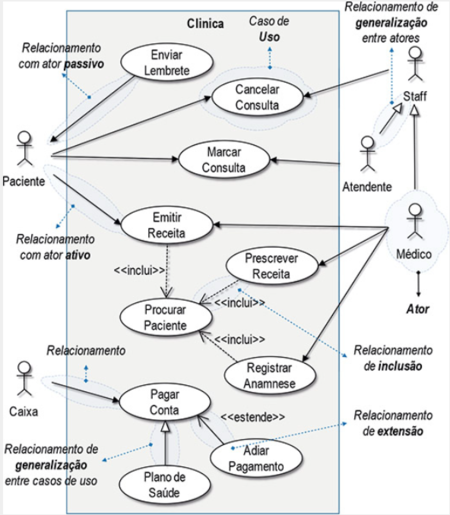

# Casos de Uso

## 1. Introdução
&emsp;&emsp;Uma das ferramentas que auxiliam no processo de identificação dos requisitos sob o ponto de vista dos diversos stakeholders são os Diagramas de Casos de Uso. Sendo assim, nestes diagramas fazemos as representações gráficas dos requisitos funcionais do sistema, assim, oferecendo uma maneira mais simples de comunicação com os stakeholders.

&emsp;&emsp;Diante disso, de acordo com Vazquez e Siqueira (2016) podemos definir um caso de uso como um conjunto de passos que descreve um cenário principal e possíveis cenários alternativos para um ator alcançar um objetivo com o uso do sistema.  

## 2. Diagramas de Casos de Uso
&emsp;&emsp;Os Diagramas de Caso de Uso, com forme dito anteriormente, representam graficamente os requisitos funcionais do sistema. Dessa forma, existem algums elemntos básicos que permitem esta representação gráfica, e estes são:

### 2.1 Atores
&emsp;&emsp; É o papel desempenhado por um usuário ou qualquer outro sistema que interaje com o sistema que está sendo projetado. Aliado a isso, os atores residem fora das fronteiras do sistema, assim, asssumindo o papel de usuário do sistema, e eles são representados como mostrado na Figura 1.

<figcaption align='center'>
    <b>Figura 1: Ator de Caso de Uso</b>
     <small>Fonte: Engenharia de Requisitos</small> 
</figcaption>

### 2.2 Relacionamentos
&emsp;&emsp; Representam as interações entre os atores e os casos de uso, ou então, a interação entre casos de uso. E estes relacionamentos podem ser do tipo:

- <b>Associação:</b> representa a comunicação entre um caso de uso e um ator, podendo este ator ser passivo, assim não precisando interagir com o sistema para que esta comunicação ocorra. É representado por um seta continua que sai do ator em direção ao caso de uso, no caso de um ator ativo, e saindo do caso de uso até o ator no caso de uso passivo. Ambos representados na figura 2.
- <b>Generalização:</b> é utilizado quando o comportamento de um caso de uso (geral) é herdado por outro caso de uso (especializado). É representado por uma linha contínua que inicia no caso de uso especializado e termina em uma seta aberta que aponta para o caso de uso geral, como mostrado na figura 2.
- <b>Extensão:</b> representa um comportamento opcional que o caso de uso que estende possui. É representado como uma seta pontilhada que origina no caso de uso de extensão em direção ao caso de uso base, conforme representado na figura 2.
- <b>Inclusão:</b> o caso de uso incluído representa um comportamento obrigatório que o caso de uso que inclui deve possuir. É representado por uma seta pontilhada que se origina no cado de uso base em direção ao caso de uso incluído, como mostrado na figura 2.

<figcaption align='center'>
    <b>Figura 2: Exemplo diagrama de caso de uso</b>
     <small>Fonte: Engenharia de Requisitos</small> 
</figcaption>

## 3. Casos de Uso Noruh
&emsp;&emsp;Para uma melhor vizualização, dividimos os diagramas em fluxos que agrupam casos de usos semelhantes, estes podem ser econtrados a partir dos links abaixo:

- [Fluxo de Conta](../modelagem/Diagramas/CasoDeUso1.md)
- [Fluxo de Pedido](../modelagem/Diagramas/CasoDeUso2.md)
- [Fluxo de Pesquisa e Página de Restaurante](../modelagem/Diagramas/CasoDeUso3.md)
## Histórico de Versão

| Versão |                Alteração               | Responsável |         Revisor        |  Data |
|:------:|:--------------------------------------:|:-----------:|:----------------------:|:-----:|
|   1.0  |                    -                   |    Lucas | Eurico | 17/07 |

## Referências
- REINEHR, S. Engenharia de Requisitos; Grupo A, 2020.
- VAZQUEZ, C; SIQUEIRA, G. Engenharia de Requisitos: software orientado a negócio; Editora Brasport, 2016.
