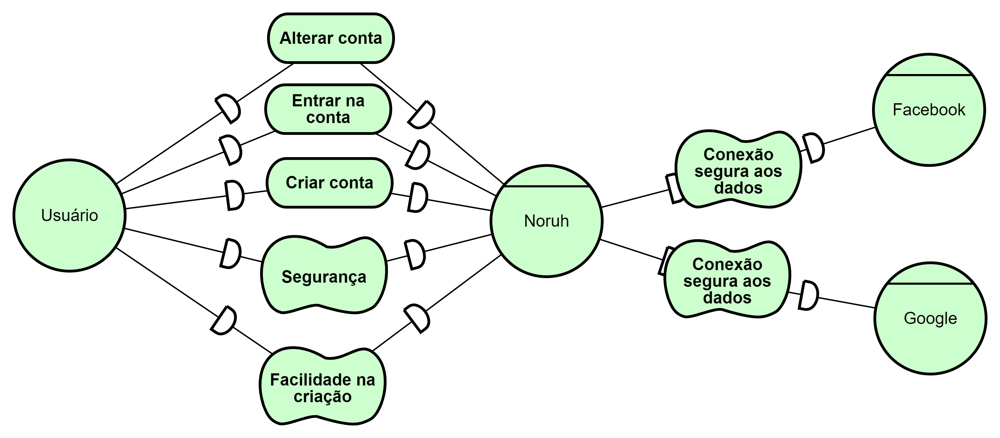
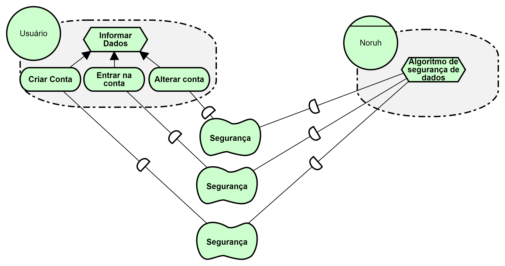
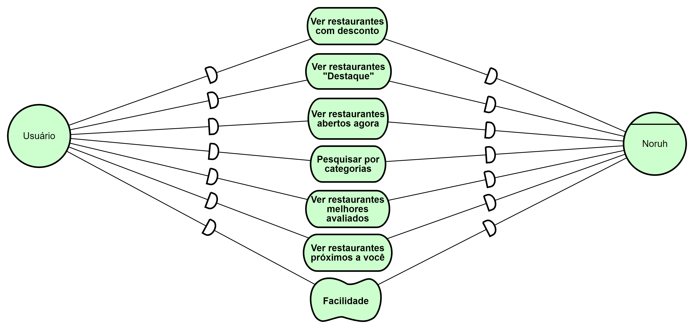
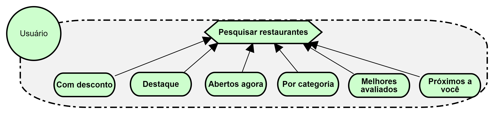
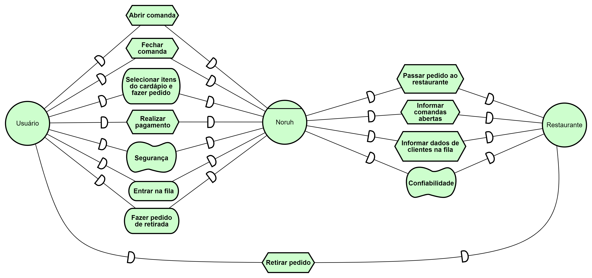
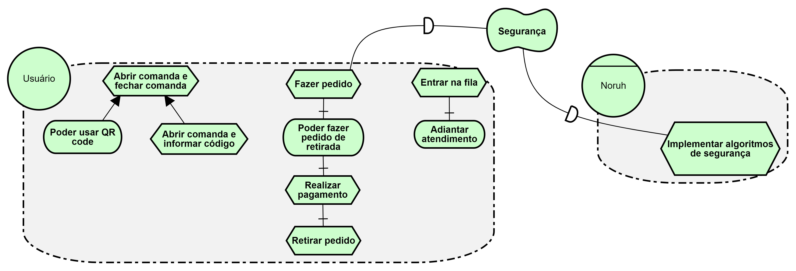

# iStar

## 1. Introdução
&emsp;&emsp; A técnica de modelagem iStar, busca conseguir a definição e a especificação de elementos que farão parte do produto final para sua compreensão (Sanderson, iStar4G). A técina iStar é utilizado em várias áreas, buscando um foco social, estratégico e intencional da modelagem do seu produto, trazendo uma orientação que busca o objetivo e os atores para o projeto(iStar Language Guide). Desta forma, o iStar detalha a visualização de um contexto do seu projeto, relacionando atores, problemas, objetivos e soluções.

## 2. Metodologia
&emsp;&emsp; Para se aplicar a técnica iStar no nosso projeto, faremos diagramas de acordo com as referências abordadas, e utilizaremos a ferra menta [piStar]( https://www.cin.ufpe.br/~jhcp/pistar/tool/#.) para fazê-los. Sendo assim, iremos separar os digramas em 3 temas: Conta, Pesquisa e Pedido.

## 3. Diagramas
### 3.1 Conta
#### Modelo dependência

<figcaption align='center'>
    <b>Figura 1: Modelo de dependência Conta</b>
         <small>Fonte: Elaboração Própria</small>
</figcaption>

#### Modelo rationale

<figcaption align='center'>
    <b>Figura 2: Modelo rationale Conta</b>
         <small>Fonte: Elaboração Própria</small>
</figcaption>       

### 3.2 Pesquisa
#### Modelo dependência

<figcaption align='center'>
    <b>Figura 3: Modelo de dependência Pesquisa</b>
         <small>Fonte: Elaboração Própria</small>
</figcaption> 

#### Modelo rationale

<figcaption align='center'>
    <b>Figura 4: Modelo rationale Pesquisa</b>
         <small>Fonte: Elaboração Própria</small>
</figcaption> 

### 3.3  Pedido
#### Modelo dependência

<figcaption align='center'>
    <b>Figura 5: Modelo de depedência Pedido</b>
         <small>Fonte: Elaboração Própria</small>
</figcaption> 

#### Modelo rationale

<figcaption align='center'>
    <b>Figura 6: Modelo rationale Pedido</b>
         <small>Fonte: Elaboração Própria</small>
</figcaption> 

## Referências
- Sanderson. iStar4G: Estendendo a linguagem iStar 2.0 para modelagem de jogos digitais. Disponível em: http://r1.ufrrj.br/nuesgames/Sanderson.pdf. Acesso em: 29 de ago. de 2022
- iStar Language Guide. Disponível em: iStar Language Guide.. Acesso em: 29 de ago. de 2022
-  piStar tool. Disponível em: https://www.cin.ufpe.br/~jhcp/pistar/tool/#. Acesso em: 29 de ago. de 2022
- Projeto da matéria de requisitos de software da FGA UnB(https://requisitos-de-software.github.io/2021.1-Ingresso.com/modelagem/istar/)
- Projeto da matéria de requisitos de software da FGA UnB(https://requisitos-de-software.github.io/2021.2-Tembici/)

## Histórico de versão

| Versão |      Alteração      | Responsável |           Revisor            |   Data   | Hora  |
| :----: | :-----------------: | :---------: | :--------------------------: | :------: | :------: |
|  1.0   |          -          |    João Henrique    |Eurico               | 29/08/22 |14:00 às 15:30 |
|  1.1   |          Adicionando iStar da conta|    João Henrique    |Eurico               | 29/08/22 |20:30 às 21:15 |
|  1.2   |          Adicionando iStar da pesquisa e do pedido|    Eurico    |Lucas               | 29/08/22 |21:00 às 23:30 |
|  1.3   |       Arquivo Revisado |    Lucas    | -             | 30/08/22 |19:00 às 19:30 |