# NFR Framework

## 1. Introdução

&emsp;&emsp;Como descritp por Silva (2019), o framework NFR (CHUNG et al., 2000), foi admitido por propor uma abordagem especifica para o processamento de requisitos não funcionais e fornecer uma profunda representação para expressar esses requisitos, além das relações e correlações entre os mesmos.

&emsp;&emsp;Os requisitos não funcionais representados pelo framework NFR, são normalmente expressados através de um grafo SIG, e o seu principal objetivo é ajudar os desenvolvedores na implementacao de soluções personalizadas.

&emsp;&emsp;O framework leva em consideração algumas características do domínio e do sistema, sendo elas:

 * Requisitos não funcionais
 * Requisitos funcionais
 * Prioridades e carga de trabalho

## 2. Legendas
### 2.1 Softgoals

&emsp;&emsp;Softgoals são objetivos que não possuem uma clara definição nem critérios de satisfação precisos.

 * Softgoals NFR: Representam requisitos não funcionais
 * Softgoals de Operacionalização: Representam soluções de implementação para satisfazer softgoals NFR ou outras softgoals de operacionalização
 * Softgoals de Afirmação: Justificativas para apioar ou negar a forma como softgoals são priorizados

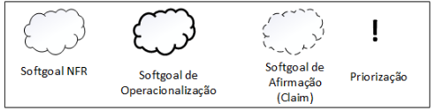

<figcaption align='center'>
    <b>Figura 1: Representação gráfica softgoals</b>
     <small>Fonte: (CHUNG et al., 2000)</small>
</figcaption>

### 2.2 Decomposições

&emsp;&emsp;As decomposições refinam os softgoals para obter softgoals mais especializados, de forma que estes possam auxiliar na construção do projeto.

 * Decomposição de Softgoal NFR
 * Decomposição de Operacionalização
 * Decomposição de Afirmação (Claims)
 * Priorização

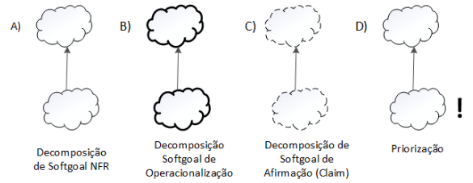

<figcaption align='center'>
    <b>Figura 2: Representação gráfica tipos de decomposição</b>
     <small>Fonte: (CHUNG et al., 2000)</small>
</figcaption>

### 2.3 Contribuições

&emsp;&emsp;Quando um softgoal descendente contribui de forma total ou parcial, e de forma positiva ou negativa, para a satisfação de um softgoal ascendente

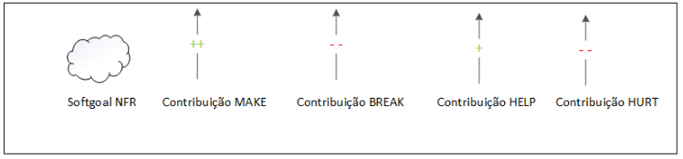

<figcaption align='center'>
    <b>Figura 3: Representação gráfica contribuições make, break, help, hurt</b>
     <small>Fonte: (CHUNG et al., 2000)</small>
</figcaption>

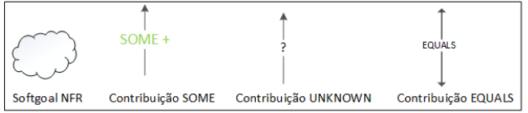

<figcaption align='center'>
    <b>Figura 4: Representação gráfica contribuições Some, Unknown e equals</b>
     <small>Fonte: (CHUNG et al., 2000)</small>
</figcaption>

### 2.4 Rótulos

&emsp;&emsp;Os rótulos sao graus de satisfacao, determinados a partir de um processo de avaliacao.

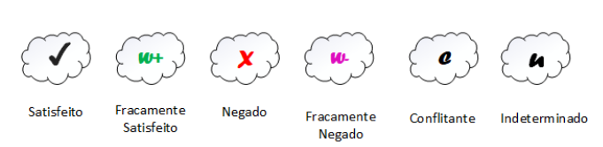

<figcaption align='center'>
    <b>Figura 5: Representação gráfica rótulos</b>
     <small>Fonte: (CHUNG et al., 2000)</small>
</figcaption>

## 3. Gráficos de Interdependência de Softgoals (SIG)
&emsp;&emsp; Com o objetivo de organizarmos nossos gráficos, os separamos com base nas classifições da metologia FURPS+ definida em nossa [Especificação Suplementar](./especificacao.md), como podemos ver abaixo:

### 3.1 SIG de Usabilidade

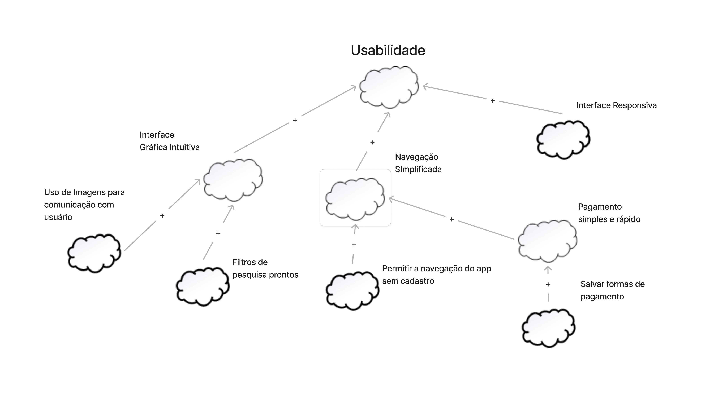

<figcaption align='center'>
    <b>Figura 6: SIG de Usabilidade</b>
     <small>Fonte: Elaboração Própria</small>
</figcaption>

### 3.1.1 SIG de Usabilidade com propagação

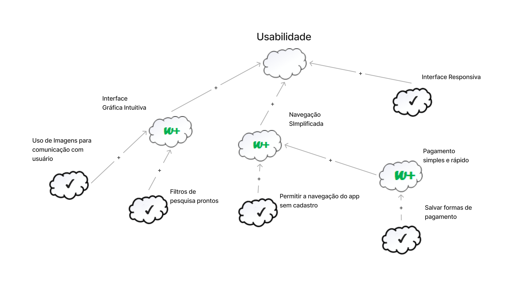

<figcaption align='center'>
    <b>Figura 7: SIG de Usabilidade com propagação</b>
     <small>Fonte: Elaboração Própria</small>
</figcaption>

### 3.2 SIG de Confiabilidade

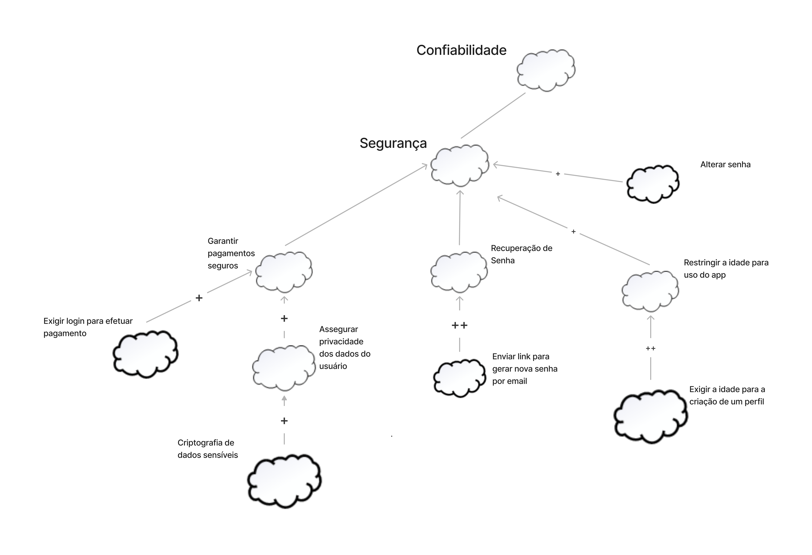

<figcaption align='center'>
    <b>Figura 8: SIG de confiabilidade</b>
     <small>Fonte: Elaboração Própria</small>
</figcaption>

### 3.2.1 SIG de Confiabilidade com propagação

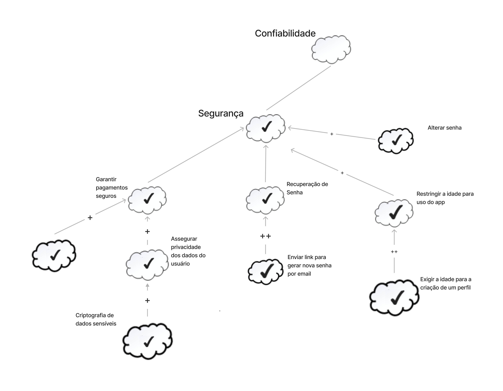

<figcaption align='center'>
    <b>Figura 9: SIG de confiabilidade com propagação</b>
     <small>Fonte: Elaboração Própria</small>
</figcaption>

### 3.3 SIG de Desempenho

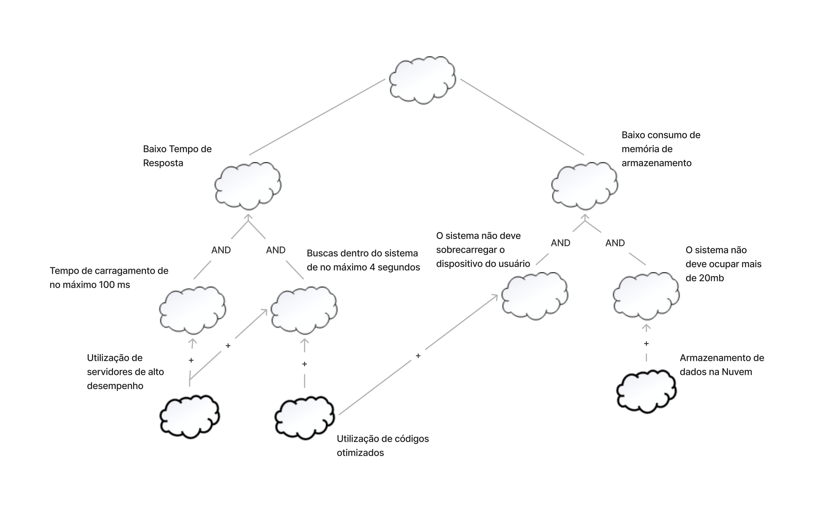

<figcaption align='center'>
    <b>Figura 10: SIG de Desempenho</b>
     <small>Fonte: Elaboração Própria</small>
</figcaption>

### 3.3.1 SIG de Desempenho com propagação

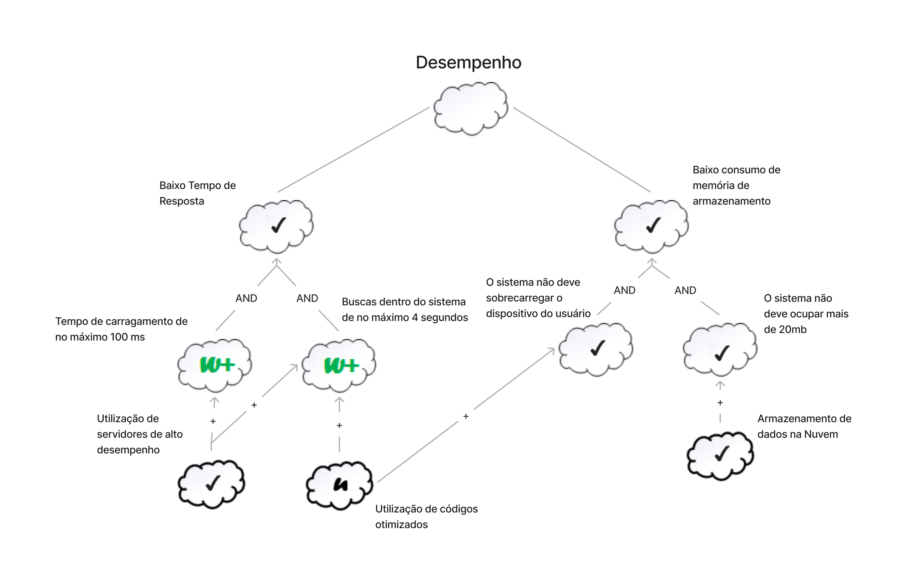

<figcaption align='center'>
    <b>Figura 11: SIG de Desempenho com propagação</b>
     <small>Fonte: Elaboração Própria</small>
</figcaption>

### 3.3 SIG de Suportabilidade

<figcaption align='center'>
    <b>Figura 12: SIG de Suportabilidade</b>
     <small>Fonte: Elaboração Própria</small>
</figcaption>

### 3.3.1 SIG de Suportabilidade com propagação

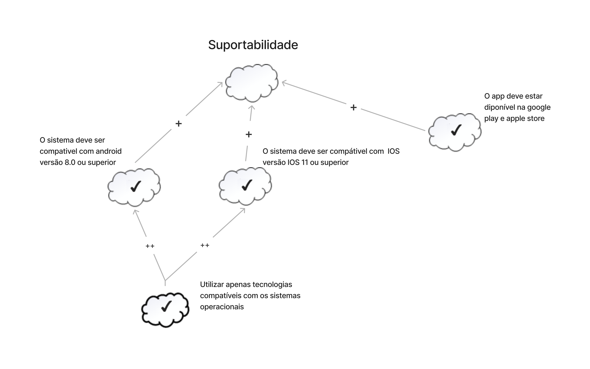

<figcaption align='center'>
    <b>Figura 13: SIG de Suportabilidade com propagação</b>
     <small>Fonte: Elaboração Própria</small>
</figcaption>

## Referências
- NFR4ES: Um Catálogo de Requisitos Não-Funcionais para Sistemas Embarcados [Reinaldo Antônio da Silva; Universidade Federal de Pernambuco; 2019]

## Histórico de Versão

| Versão |                Alteração               | Responsável |         Revisor        |  Data |
|:------:|:--------------------------------------:|:-----------:|:----------------------:|:-----:|
|   1.0  | Criação do documento           |    Eurico  | Lucas | 31/07 |
|   1.1  | Adicao do conteudo (introducao, legendas, referencias e historico de versao)           |    Eurico  | Lucas | 01/08 |
|   1.2  | Correções gramáticais e em imagens e legendas           |    Eurico  | Lucas | 02/08 |
|   2.0  | Adicina Gráficos          |    Lucas  | João | 02/08 |
|   2.1  | Arquivo revisado          |    João  | - | 02/08 |
