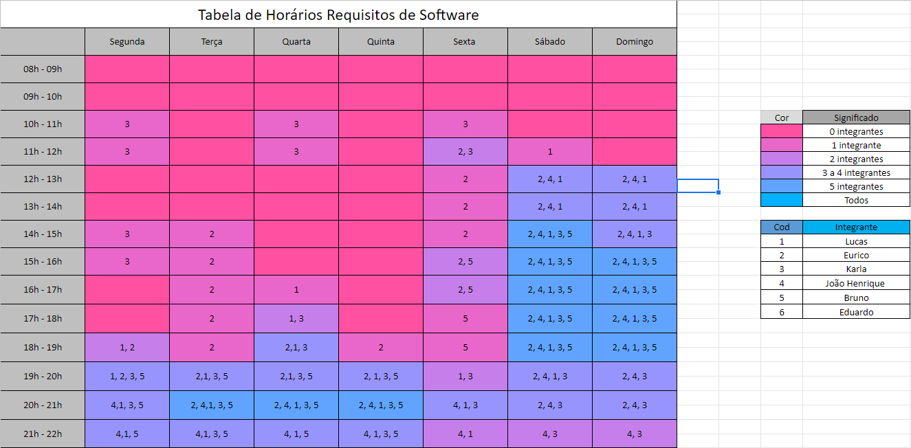

# Cronograma

## 1. Introdução

&emsp;&emsp; O cronograma geral abaixo foi definido com base no próprio plano de ensino da disciplina. Dessa forma, nos organizamos de modo que iremos dividí-lo por entrega. E cada uma destas entregas será divida em atividades, cada uma delas com: data de entrega, responsáveis e revisores.

## 2. Cronograma Geral

| Entrega | Descrição                    | Prazo Previsto | Prazo final |
| ------- | ---------------------------- | -------------- | ----------- |
| 1       | Planejamento do projeto      | 26/06          | 29/06       |
| 2       | Elicitação de requisitos     | 10/07          | 13/07       |
| 3       | Modelagem de requisitos      | 17/07          | 20/07       |
| 4       | Modelagem de requisitos Ágil | 31/07          | 03/08       |
| 5       | Análise de requisitos        | 14/08          | 17/08       |
| 6       | Pós-Rastreabilidade          | 21/08          | 24/08       |
| 7       | Projeto Final                | 10/09          | 12/09       |

## 3. Cronograma por entrega

&emsp;&emsp; Nesse cronograma abaixo por entrega colocamos as atividades realizadas para a entrega, os integrantes que as fizeram, o revisor das atividades e a data em que foi entregue.

### 3.1 Entrega 1

|          Atividade           |                Responsável                 |        Revisor        | Data  |
| :--------------------------: | :----------------------------------------: | :-------------------: | :---: |
| Ver repostório da disciplina |                   Todos                    |         Todos         | 26/06 |
|        Selecionar app        |                   Todos                    |         Todos         | 26/06 |
|         Criar pagina         |            Lucas, João Henrique            |        Eurico         | 26/06 |
|    Adicionar ferramentas     |           João Henrique, Eurico            |         Bruno         | 26/06 |
|     Adicionar cronograma     |        Lucas, João Henrique, Eurico        |        Eduardo        | 26/06 |
|    Adicionar equipe/sobre    |        Lucas, João Henrique, Eurico        |         Karla         | 26/06 |
|         Rich picture         |                   Lucas                    | João Henrique, Eurico | 26/06 |
|      Rich picture V2.0       |                   Lucas                    | João Henrique, Eurico | 27/06 |
|     Gravar apresentação      | João Henrique, Karla, Lucas, Eurico, Bruno |                       | 27/06 |

### 3.2 Entrega 2

|         Atividade         |                Responsável                 |              Revisor              | Data  |
| :-----------------------: | :----------------------------------------: | :-------------------------------: | :---: |
|    Fazer brainstorming    | João Henrique, Karla, Bruno, Eurico, Lucas |               Todos               | 05/07 |
|      Fazer personas       |                   Eurico                   | João Henrique, Karla, Bruno,Lucas | 09/07 |
|    Criar questionário     |        Lucas, João Henrique, Karla         |               Todos               | 11/07 |
|    Fazer introspecção     |     João Henrique, Lucas, Karla, Bruno     |              Eurico               | 09/07 |
|     Fazer observação      | Lucas, João Henrique, Bruno, Karla, Eurico |               Todos               | 09/07 |
| Fazer priorização(MoSCoW) | Lucas, João Henrique, Eurico, Bruno, Karla |               Todos               | 09/07 |
|      Ver Resultados       |               João Henrique                |               Todos               | 09/07 |
|    Gravar apresentação    | João Henrique, Karla, Lucas, Eurico, Bruno |                                   | 11/07 |

### 3.3 Entrega 3

|            Atividade            |                Responsável                 |           Revisor            | Data  |
| :-----------------------------: | :----------------------------------------: | :--------------------------: | :---: |
| Fazer Especificação Suplementar |                   Eurico                   |            Todos             | 17/07 |
|         Fazer Cenários          |               João Henrique                |            Todos             | 16/07 |
|          Fazer léxicos          |               Bruno e Karla                | Eurico, João Henrique, Lucas | 18/07 |
|       Fazer casos de uso        |                   Lucas                    |            Todos             | 17/07 |
|       Gravar apresentação       | João Henrique, Karla, Lucas, Eurico, Bruno |                              |   -   |

### 3.4 Entrega 4

|                   Atividade                   |                Responsável                 |                  Revisor                   | Data  |
| :-------------------------------------------: | :----------------------------------------: | :----------------------------------------: | :---: |
| Fazer a introdução e metodologia NFRFramework |                   Eurico                   |                   Lucas                    | 01/08 |
|        Fazer os Gráficos NFRFramework         |                   Lucas                    |                    João                    | 02/08 |
|                Fazer o Backlog                |                   Bruno                    |                     -                      | 02/08 |
|          Fazer Historias de Usuário           |            João Henrique, Karla            |                     -                      | 31/07 |
|              Gravar apresentação              | João Henrique, Karla, Lucas, Eurico, Bruno |                     -                      | 02/08 |
|       Edição e postagem da apresentação       |                   Lucas                    | João Henrique, Karla, Lucas, Eurico, Bruno | 03/08 |

### 3.5 Entrega 5

|                  Atividade                  |                Responsável                 |    Revisor    | Data  |
| :-----------------------------------------: | :----------------------------------------: | :-----------: | :---: |
|         Planejamento da verificação         |                   Lucas                    |     João      | 16/08 |
|       Fazer verificação dos cenários        |                   Bruno                    |     Lucas     | 16/08 |
|             Fazer prototipação              |                   Lucas                    | João Henrique | 16/08 |
|       Fazer verificação Rich Picture        |               João Henrique                |     Lucas     | 16/08 |
|          Fazer verificação backlog          |                   Lucas                    | João Henrique | 14/08 |
| Fazer verificação especificação suplementar |               João Henrique                |     Lucas     | 16/08 |
|          Fazer verificação Léxicos          |                   Bruno                    |     Lucas     | 16/08 |
|          Fazer validação viewpoint          |                   Eurico                   |     Bruno     | 16/08 |
|          Fazer validação informal           |                   Eurico                   |     Bruno     | 16/08 |
|       Fazer verificação NFR Framework       |                   Karla                    |    Eurico     | 16/08 |
|       Fazer verificação Casos de Uso        |                   Karla                    |    Eurico     | 16/08 |
|             Gravar apresentação             | João Henrique, Karla, Lucas, Eurico, Bruno |       -       | 17/8  |
|         Gravar entrevista protótipo         |                   Lucas                    | João Henrique | 17/8  |

### 3.6 Entrega 6

|                   Atividade                   |                Responsável                 | Revisor | Data |
| :-------------------------------------------: | :----------------------------------------: | :-----: | :--: |
|        Fazer RFs 1 ao 9 backward-from         |               João Henrique                |  Lucas  | 24/8 |
|         Fazer RFs 1 ao 9 forward-from         |               João Henrique                |  Lucas  | 24/8 |
|       Fazer RFs 10 ao 19 backward-from        |                   Lucas                    |  João   | 24/8 |
|        Fazer RFs 10 ao 19 forward-from        |                   Lucas                    |  João   | 24/8 |
|       Fazer RFs 20 ao 29 backward-from        |                   Eurico                   |  Karla  | 24/8 |
|        Fazer RFs 20 ao 29 forward-from        |                   Eurico                   |  Karla  | 24/8 |
| Fazer RFs 30 e 31 / RNFs 1 ao 7 backward-from |                   Karla                    |  Bruno  | 24/8 |
| Fazer RFs 30 e 31 / RNFs 1 ao 7 forward-from  |                   Karla                    |  Bruno  | 24/8 |
|       Fazer RNFs 8 ao 17 backward-from        |                   Bruno                    | Eurico  | 24/8 |
|        Fazer RNFs 8 ao 17 forward-from        |                   Bruno                    | Eurico  | 24/8 |
|              Gravar apresentação              | João Henrique, Karla, Lucas, Eurico, Bruno |    -    | 24/8 |

### 3.7 Entrega 7

|                   Atividade                   |     Responsável     | Revisor | Data | Feito | 
| :-------------------------------------------: | :-----------------: | :-----: | :--: |:--:|
|       Adicionar perfil de usuário             |        Lucas        |  João   | 29/8 |✅|
|           Verificação das personas            |        Lucas        |  João   | 29/8 |✅|
|             Revisar Brainstorming             |        Bruno        |  João   | 29/8 |✅|
|             Verificação Introspecção          |        Lucas        |  João   | 29/8 |✅|
|              Revisar Observação               |        Lucas        |  João   | 29/8 |✅|
|             Revisar Questionário              |       Eurico        |  João   | 29/8 |✅|
|                  Fazer iStar                  |    João, Eurico     |  Lucas  | 29/8 |✅|
|     Fazer priorização First Things First      |     João, Lucas     |  Lucas  | 31/8 |✅|
|      Fazer priorização House of Quality       |    Eurico, Bruno    |  João  | 31/8 |✅|
|            Adicionar IDs Cenários             |        Karla        |  Lucas  | 31/8 |✅|
|  Adicionar hyperlinks e titulos nos léxicos   |        Bruno        |  João   | 31/8 |✅|
|        Adiconar metodologia do projeto        |        Karla        |  Lucas  | 31/8 |✅|
|              Fazer storytelling               |    Karla , Bruno    | Eurico  | 3/9  ||
|        Fazer observação participativa         | Lucas               |  Karla  | 3/9  |✅|
|        Fazer analise de documentação         |  João                |  Karla  | 3/9  |✅|
| Fazer verificação da analise de documentação |  Eurico  |  Karla  | 3/9  |✅|
|            Verificação Foward-from            |        Lucas        |  João   | 5/9  |✅|
|           Verificação Backward-from           |        Bruno        |  João   | 5/9  ||
|              Fazer matriz geral               |    João, Eurico     |  João   | 5/9  |✅|
| Correções da verificação histórias de usuário | Eurico, João |  Lucas  | 7/9  |✅|
|               Revisão viewpoint               |       Eurico        |  Bruno  | 7/9  ||
|             Melhoria no protótipo             |        Lucas        |  João   | 7/9  |✅|
|       Melhoria motivação da escolha app       |        Bruno        |  Lucas  | 8/9  ||
|               Verificação iStar               |        Karla        |  João   | 8/9  ||
|           Revisão Geral do Projeto            |        Todos        |    -    | 10/9 ||
|           Fazer slides                        |        Todos        |    -    | 10/9 ||
|            Gravação entrega final             |        Todos        |    -    | 11/9 ||

## 4. Tabela de Horários (HeatMap)

&emsp;&emsp; Essa tabela de horários foi feita baseado nos horários das pessoas, que de acordo com o seu número colocavam os horários que geralmente estariam disponíveis durante a semana para ficar mais fácil decidirmos os horários de encontro com o time.

<figcaption align='center'>
    <b>Figura 2: HeatMap</b>
     <small>Fonte: Elaboração própria</small> 
</figcaption>

### 4.2 Histórico de Versão

| Versão |              Alteração              |      Responsável      |    Revisor    | Data  |
| :----: | :---------------------------------: | :-------------------: | :-----------: | :---: |
|  1.0   |                  -                  |     João Henrique     |     Lucas     | 23/06 |
|  1.1   |          Colorindo Células          |         Lucas         | João Henrique | 03/07 |
|  2.0   |        Cronograma entrega 2         | João Henrique, Bruno  |     Lucas     | 03/07 |
|  3.0   |        Cronograma entrega 3         |     João Henrique     |     Lucas     | 16/07 |
|  4.0   |        Cronograma entrega 4         |     João Henrique     |     Lucas     | 29/07 |
|  5.0   |        Cronograma entrega 5         |     João Henrique     |     Lucas     | 14/08 |
|  6.0   |        Cronograma entrega 6         |     João Henrique     |     Lucas     | 22/08 |
|  6.1   |  Atualizando cronograma entrega 6   | João Henrique, Eurico |     Lucas     | 23/08 |
|  6.1   |  Atualizando cronograma entrega 6   | João Henrique, Eurico |     Lucas     | 23/08 |
|  7.0   |  Atualizando cronograma entrega 7   |         Lucas         |     João      | 24/08 |
|  7.1   | Atualizando cronograma entrega 7 V2 |         Todos         |     João      | 25/08 |

## Referências

- Plano de ensino da disciplina de Requisitos de Software Turma-02 2022
