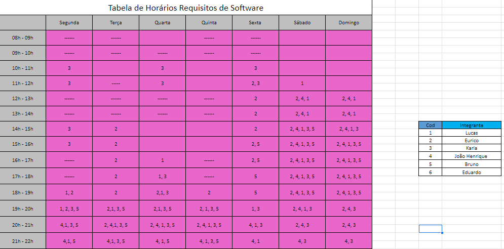

# Cronograma

## 1. Introdução
&emsp;&emsp; O cronograma geral foi definido com base no próprio plano de ensino da disciplina. Dessa forma, nos organizamos de modo que iremos dividí-lo por entrega. E cada uma destas entregas será divida em atividades, cada uma delas com: data de entrega, responsáveis e revisores.

## 2. Cronograma Geral

| Entrega | Descrição                    | Prazo Previsto | Prazo final |
|---------|------------------------------|----------------|-------------|
|    1    |    Planejamento do projeto   |      26/06     |    29/06    |
|    2    |   Elicitação de requisitos   |      10/07     |    13/07    |
|    3    |    Modelagem de requisitos   |      17/07     |    20/07    |
|    4    | Modelagem de requisitos Ágil |      31/07     |    03/08    |
|    5    |     Análise de requisitos    |      14/08     |    17/08    |
|    6    |      Pós-Rastreabilidade     |      21/08     |    24/08    |
|    7    |         Projeto Final        |      10/09     |    12/09    |

## 3. Cronograma por entrega
### 3.1 Entrega 1

|           Atividade          |          Responsável                 |    Revisor    |  Data |
|:----------------------------:|:------------------------------------:|:-------------:|:-----:|
| Ver repostório da disciplina |             Todos                    |               | 26/06 |
|        Selecionar app        |             Todos                    |               | 26/06 |
|         Criar pagina         |     Lucas, João Henrique             |               | 26/06 |
|     Adicionar ferramentas    |     João Henrique, Eurico            |               | 26/06 |
|     Adicionar cronograma     |     Lucas, João Henrique, Eurico     |               | 26/06 |
|    Adicionar equipe/sobre    |     Lucas, João Henrique, Eurico     |               | 26/06 |
|         Rich picture         |             Lucas                    | João Henrique | 26/06 |
|      Gravar apresentação     |                                      |               |       |

### 3.2 Entrega 2

### 3.3 Entrega 3

### 3.4 Entrega 4

### 3.5 Entrega 5

### 3.6 Entrega 6

### 3.7 Entrega 7

## 4. Tabela de Horários

Figura 1: Tabela de horários

## Referências
- Plano de ensino da disciplina de Requisitos de Software Turma-02 2022