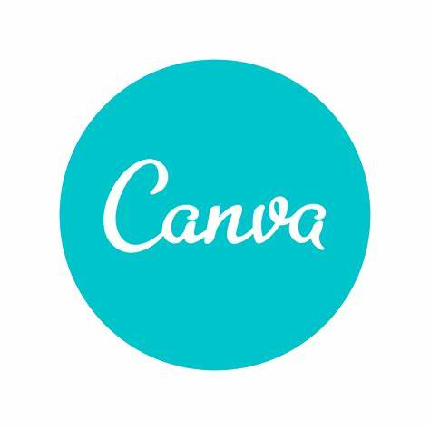
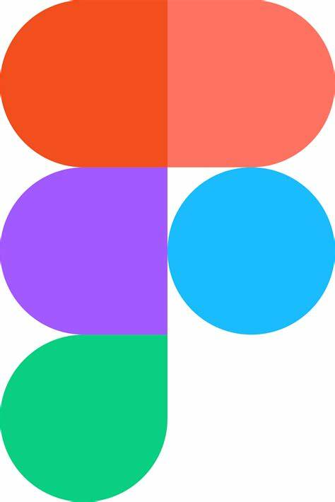

# Ferramentas

## Utilização

&emsp;&emsp;Para que o projeto seja concluído, serão necessárias os usos de tais ferramentas:

| | Ferramenta | Finalidade |
| :------: | :----------: | :---------------------------------------------------: |
|     | Canva     | Utilizado para a elaboração das apresentações |
|   | Discord   | Reuniões da equipe para a elaboração das atividades |
|     | Figma     | Utilizado para fazer o Rich Picture |
|    | Github    | Repositório do Projeto |
|     | Teams     | Utilizado para a gravação das apresentações do projeto |
|    | Trello  | Utilizado para definir as atividades dos integrantes do projeto |
|    | VsCode  | Editor de texto para o repositório |
|  | Whatsapp | Aplicativo de conversas, onde criamos um grupo para o projeto |
