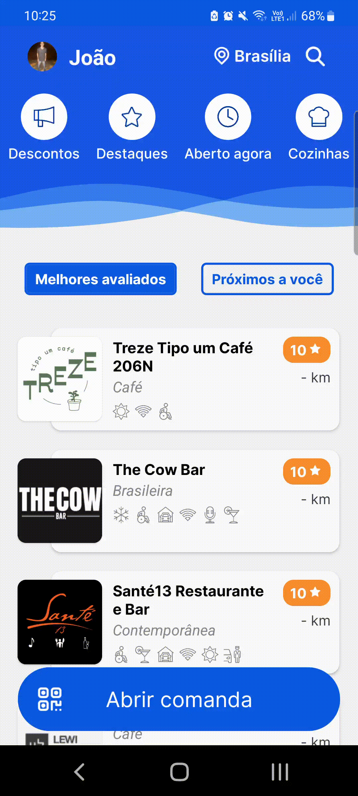
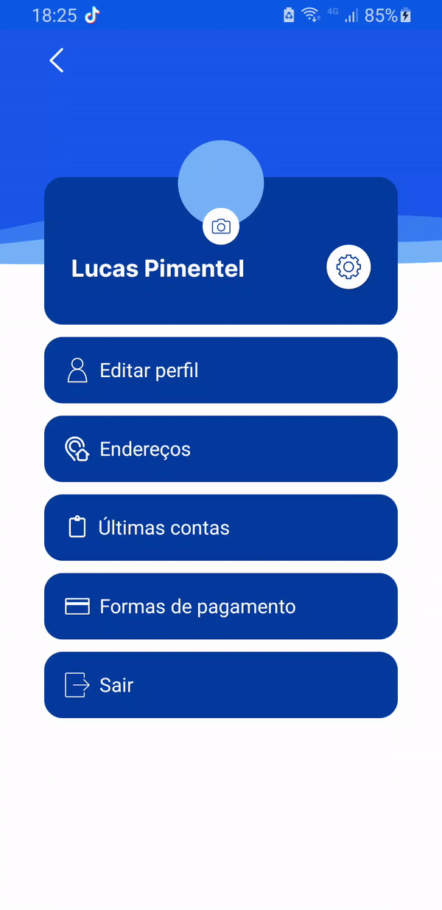
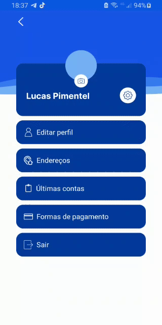
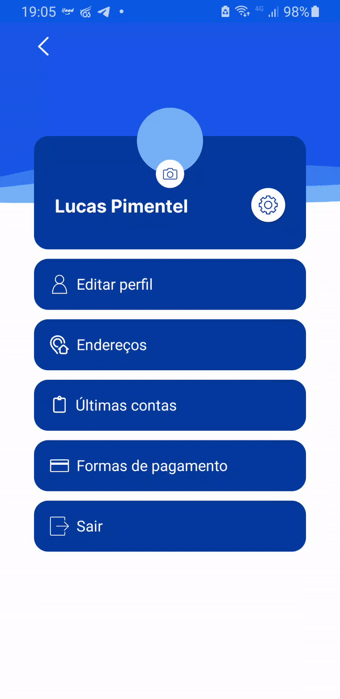
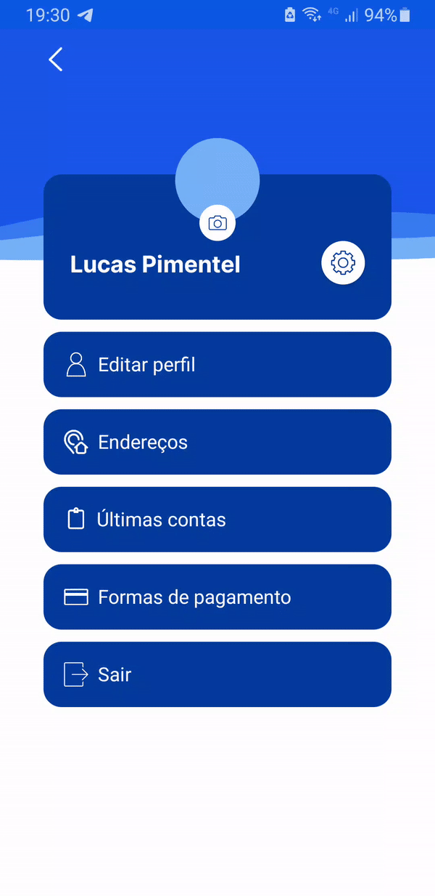
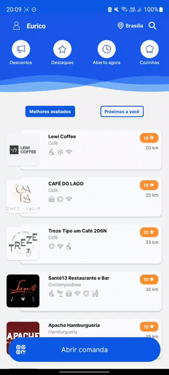
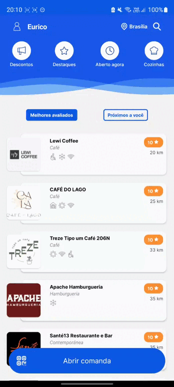
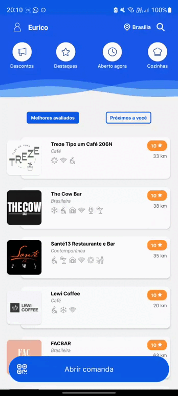
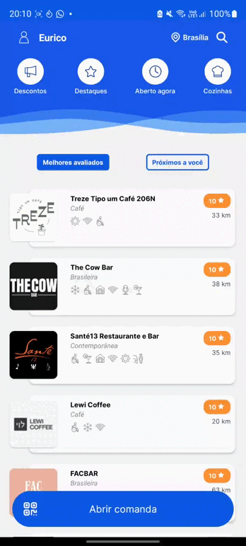
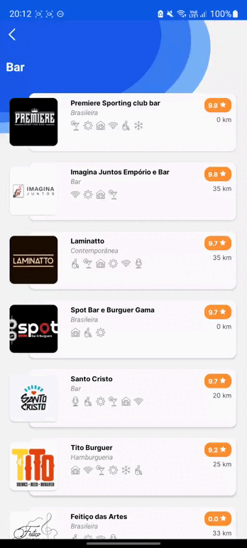

# Forward-from

## 1. Introdução

&emsp;&emsp; A pós-rastreabilidade tem como objetivo ligar os artefatos que são criados durante o ciclo de vida de um projeto aos seus devidos requisitos elicitados. Diante disso, neste documento iremos fazer a rastreabilidade foward-from, que tem como objetivo ligar os requisitos aos artefatos gerados durante o projeto, e também se estes requisitos foram implementados ou não no app.

## 2. Metodologia

&emsp;&emsp; Para realizar a rastreabilidade foward-from dos requisitos funcionais iremos utilizar uma tabela divida pelas seguintes linhas:

- Identificador do requisito
- Épico onde se encontra o requisito no backlog
- Tema onde se encontra o requisito no backlog
- História de usuário correspondente ao requisito
- Artefatos derivados do requisito 
- Status da implementação do requisito
- Vídeo da tela onde esta implementada a funcionalidade

&emsp;&emsp; Já para a rastreabilidade foward-from dos requisitos não-funcionais iremos utilizar uma tabela divida pelas seguintes linhas:

- Identificador do requisito
- Artefatos derivados do requisito
- Status da implementação do requisito
- Imagem da implementação

## 3. Legenda:

- RF: Requisito Funcional
- RNF: Requisito Não Funcional
- C: cenário
- UC: Caso de uso
- US: História de usuário

## 4. Requisitos Funcionais

### RF1

|          RF1           |                                                O usuário deve poder criar uma conta                                                |
| :--------------------: | :--------------------------------------------------------------------------------------------------------------------------------: |
|         Épico          | [Gerenciamento de conta](https://requisitos-de-software.github.io/2022.1-Noruh/modelagem/backlog/#41-epico-gerenciamento-de-conta) |
|          Tema          |    [Cadastro e login](https://requisitos-de-software.github.io/2022.1-Noruh/modelagem/backlog/#41-epico-gerenciamento-de-conta)    |
|           US           |         [US01](https://requisitos-de-software.github.io/2022.1-Noruh/modelagem/historiasDeUsuario/#3-historias-de-usuario)         |
|       Status da implementação       |                                                 Requisito totalmente implementado                               |
|Artefatos|[Cenario](https://requisitos-de-software.github.io/2022.1-Noruh/modelagem/cenarios/#caso-1-criar-perfil)   [Caso de uso](https://requisitos-de-software.github.io/2022.1-Noruh/modelagem/Diagramas/CasoDeUso1/#caso-de-uso-1-criar-conta)|
|     Funcionalidade     |                |

### RF2

|          RF2           |                                            O usuário deve poder realizar login na conta                                            |
| :--------------------: | :--------------------------------------------------------------------------------------------------------------------------------: |
|         Épico          | [Gerenciamento de conta](https://requisitos-de-software.github.io/2022.1-Noruh/modelagem/backlog/#41-epico-gerenciamento-de-conta) |
|          Tema          |    [Cadastro e login](https://requisitos-de-software.github.io/2022.1-Noruh/modelagem/backlog/#41-epico-gerenciamento-de-conta)    |
|           US           |         [US02](https://requisitos-de-software.github.io/2022.1-Noruh/modelagem/historiasDeUsuario/#3-historias-de-usuario)         |
|       Status da implementação       |                                                 Requisito totalmente implementado                                                  |
| Artefatos | [cenario](https://requisitos-de-software.github.io/2022.1-Noruh/modelagem/cenarios/#caso-1-criar-perfil)   [caso de uso](https://requisitos-de-software.github.io/2022.1-Noruh/modelagem/Diagramas/CasoDeUso1/#caso-de-uso-2-fazer-login-na-conta)|
|     Funcionalidade     |                |

### RF3

|          RF3           |                                              O usuário deve poder fazer pedidos                                              |
| :--------------------: | :--------------------------------------------------------------------------------------------------------------------------: |
|         Épico          |         [Restaurante](https://requisitos-de-software.github.io/2022.1-Noruh/modelagem/backlog/#42-epico-restaurante)         |
|          Tema          | [Fazer pedido no restaurante](https://requisitos-de-software.github.io/2022.1-Noruh/modelagem/backlog/#42-epico-restaurante) |
|           US           |      [US03](https://requisitos-de-software.github.io/2022.1-Noruh/modelagem/historiasDeUsuario/#3-historias-de-usuario)      |
|       Status da implementação       |                                              Requisito totalmente implementado                                               |
| Artefatos|[Cenario](https://requisitos-de-software.github.io/2022.1-Noruh/modelagem/cenarios/#caso-9-pedido-no-estabelecimento) [caso de uso](https://requisitos-de-software.github.io/2022.1-Noruh/modelagem/Diagramas/CasoDeUso2/#caso-de-uso-1-fazer-pedido)|
|     Funcionalidade     |          |

### RF4

|          RF4           |                                           O usuário deve poder acessar o cardápio                                            |
| :--------------------: | :--------------------------------------------------------------------------------------------------------------------------: |
|         Épico          |         [Restaurante](https://requisitos-de-software.github.io/2022.1-Noruh/modelagem/backlog/#42-epico-restaurante)         |
|          Tema          | [Fazer pedido no restaurante](https://requisitos-de-software.github.io/2022.1-Noruh/modelagem/backlog/#42-epico-restaurante) |
|           US           |      [US04](https://requisitos-de-software.github.io/2022.1-Noruh/modelagem/historiasDeUsuario/#3-historias-de-usuario)      |
|       Status da implementação       |                                              Requisito totalmente implementado                                               |
| Artefatos| [Cenario](https://requisitos-de-software.github.io/2022.1-Noruh/modelagem/cenarios/#caso-9-pedido-no-estabelecimento)   [caso de uso](https://requisitos-de-software.github.io/2022.1-Noruh/modelagem/Diagramas/CasoDeUso2/#caso-de-uso-1-fazer-pedido)|
|     Funcionalidade     |          |

### RF5

|          RF5           |                            O usuário deve poder abrir uma comanda a partir da leitura do QR Code                             |
| :--------------------: | :--------------------------------------------------------------------------------------------------------------------------: |
|         Épico          |         [Restaurante](https://requisitos-de-software.github.io/2022.1-Noruh/modelagem/backlog/#42-epico-restaurante)         |
|          Tema          | [Fazer pedido no restaurante](https://requisitos-de-software.github.io/2022.1-Noruh/modelagem/backlog/#42-epico-restaurante) |
|           US           |      [US05](https://requisitos-de-software.github.io/2022.1-Noruh/modelagem/historiasDeUsuario/#3-historias-de-usuario)      |
|       Status da implementação       |                                              Requisito totalmente implementado                                               |
| Artefatos| [Cenario](https://requisitos-de-software.github.io/2022.1-Noruh/modelagem/cenarios/#caso-9-pedido-no-estabelecimento)   [caso de uso](https://requisitos-de-software.github.io/2022.1-Noruh/modelagem/Diagramas/CasoDeUso2/#caso-de-uso-1-fazer-pedido)|
|     Funcionalidade     |          |

### RF6

|          RF6           |                                               O usuário deve poder editar seu perfil                                               |
| :--------------------: | :--------------------------------------------------------------------------------------------------------------------------------: |
|         Épico          | [Gerenciamento de conta](https://requisitos-de-software.github.io/2022.1-Noruh/modelagem/backlog/#41-epico-gerenciamento-de-conta) |
|          Tema          |    [Edição de conta](https://requisitos-de-software.github.io/2022.1-Noruh/modelagem/backlog/#41-epico-gerenciamento-de-conta)     |
|           US           |         [US06](https://requisitos-de-software.github.io/2022.1-Noruh/modelagem/historiasDeUsuario/#3-historias-de-usuario)         |
|       Status da implementação       |                                                 Requisito totalmente implementado                                                  |
| Artefatos| [Cenario](https://requisitos-de-software.github.io/2022.1-Noruh/modelagem/cenarios/#caso-7-edicao-do-perfil)   [caso de uso](https://requisitos-de-software.github.io/2022.1-Noruh/modelagem/Diagramas/CasoDeUso1/#caso-de-uso-3-editar-conta)|
|     Funcionalidade     |                |

### RF7

|          RF7           |                                                          O usuário deve poder pesquisar restaurantes                                                          |
| :--------------------: | :-----------------------------------------------------------------------------------------------------------------------------------------------------------: |
|         Épico          |  [Informações sobre estabelecimentos](https://requisitos-de-software.github.io/2022.1-Noruh/modelagem/backlog/#43-epico-informacoes-sobre-estabelecimentos)   |
|          Tema          | [Pesquisas e filtros para visualização](https://requisitos-de-software.github.io/2022.1-Noruh/modelagem/backlog/#43-epico-informacoes-sobre-estabelecimentos) |
|           US           |                      [US07](https://requisitos-de-software.github.io/2022.1-Noruh/modelagem/historiasDeUsuario/#3-historias-de-usuario)                       |
|       Status da implementação       |                                                               Requisito totalmente implementado                                                               |
| Artefatos| [Cenario](https://requisitos-de-software.github.io/2022.1-Noruh/modelagem/cenarios/#caso-9-pedido-no-estabelecimento)   [caso de uso](https://requisitos-de-software.github.io/2022.1-Noruh/modelagem/Diagramas/CasoDeUso3/#caso-de-uso-1-fazer-pesquisa-por-restaurantes)|
|     Funcionalidade     |                                           |

### RF8

|          RF8           |                                         O usuário deve poder ter acesso aos termos de uso                                          |
| :--------------------: | :--------------------------------------------------------------------------------------------------------------------------------: |
|         Épico          | [Gerenciamento de conta](https://requisitos-de-software.github.io/2022.1-Noruh/modelagem/backlog/#41-epico-gerenciamento-de-conta) |
|          Tema          |     [Termos de uso](https://requisitos-de-software.github.io/2022.1-Noruh/modelagem/backlog/#41-epico-gerenciamento-de-conta)      |
|           US           |         [US08](https://requisitos-de-software.github.io/2022.1-Noruh/modelagem/historiasDeUsuario/#3-historias-de-usuario)         |
|       Status da implementação       |                                                 Requisito totalmente implementado                                                  |
| Artefatos| [Cenario](https://requisitos-de-software.github.io/2022.1-Noruh/modelagem/cenarios/#caso-1-criar-perfil)   [caso de uso](https://requisitos-de-software.github.io/2022.1-Noruh/modelagem/Diagramas/CasoDeUso1/#caso-de-uso-1-criar-conta)|
|     Funcionalidade     |                |

### RF9

|          RF9           |                                    O usuário deve poder ver a localização dos estabelecimentos a partir do google maps                                     |
| :--------------------: | :--------------------------------------------------------------------------------------------------------------------------------------------------------: |
|         Épico          | [Informações sobre estabelecimentos](https://requisitos-de-software.github.io/2022.1-Noruh/modelagem/backlog/#43-epico-informacoes-sobre-estabelecimentos) |
|          Tema          |             [Descrição](https://requisitos-de-software.github.io/2022.1-Noruh/modelagem/backlog/#43-epico-informacoes-sobre-estabelecimentos)              |
|           US           |                     [US09](https://requisitos-de-software.github.io/2022.1-Noruh/modelagem/historiasDeUsuario/#3-historias-de-usuario)                     |
|       Status da implementação       |                                                             Requisito totalmente implementado                                                              |
| Artefatos| [Cenario](https://requisitos-de-software.github.io/2022.1-Noruh/modelagem/cenarios/#caso-5-pesquisa-de-estabelecimentos)   [caso de uso](https://requisitos-de-software.github.io/2022.1-Noruh/modelagem/Diagramas/CasoDeUso3/#caso-de-uso-2-acessar-pagina-do-restaurante)|
|     Funcionalidade     |                                        |

### RF10

|          RF10           |      O usuário deve conseguir cadastrar múltiplos endereços            |
| :--------------------: | :--------------------------------------------------------------------------------------------------------------------------------------------------------: |
|         Épico          | [Gerenciamento de Conta](../../modelagem/backlog/#41-epico-gerenciamento-de-conta) |
|          Tema          | [Cadastro e login](../../modelagem/backlog/#41-epico-gerenciamento-de-conta)       |
|           US           | [US10 ](../../modelagem/historiasDeUsuario/#3-historias-de-usuario)                |
|    Artefatos           | [UC02](../../modelagem/Diagramas/CasoDeUso1/#caso-de-uso-2---fazer-login-na-conta)  |
|Status da implementação |   Requisito totalmente implementado                                                |
|     Funcionalidade     ||

### RF11

|          RF11           |     O usuário deve conseguir fazer logout do perfil            |
| :--------------------: | :--------------------------------------------------------------------------------------------------------------------------------------------------------: |
|         Épico          | [Gerenciamento de Conta](../../modelagem/backlog/#41-epico-gerenciamento-de-conta) |
|          Tema          | [Cadastro e login](../../modelagem/backlog/#41-epico-gerenciamento-de-conta)       |
|           US           | [US11](../../modelagem/historiasDeUsuario/#3-historias-de-usuario)                |
|    Artefatos           | [UC04](../../modelagem/Diagramas/CasoDeUso1/#caso-de-uso-2---fazer-login-na-conta)   [C02](../../modelagem/cenarios/#caso-2-logout-no-perfil)|
|Status da implementação |   Requisito totalmente implementado                                                |
|     Funcionalidade     ||

### RF12

|          RF12           |    O usuário deve poder selecionar a cidade em que deseja buscar restaurantes/bares            |
| :--------------------: | :--------------------------------------------------------------------------------------------------------------------------------------------------------: |
|         Épico          | [Informações sobre Estabelecimentos](../../modelagem/backlog/#43-epico-informacoes-sobre-estabelecimentos) |
|          Tema          | [Pesquisas e Filtros para Visulaização](../../modelagem/backlog/#43-epico-informacoes-sobre-estabelecimentos)       |
|           US           | [US12](../../modelagem/historiasDeUsuario/#3-historias-de-usuario)                |
|    Artefatos           | [UC07](../../modelagem/Diagramas/CasoDeUso3/#caso-de-uso-1-fazer-pesquisa-por-restaurantes)   [C05](../../modelagem/cenarios/#caso-5-pesquisa-de-estabelecimentos)|
|Status da implementação |   Requisito parcialmente implementado                                                |
|     Funcionalidade     ||

### RF13

|          RF13           |    O usuário deve poder solicitar a conta para o pagamento fora do app            |
| :--------------------: | :--------------------------------------------------------------------------------------------------------------------------------------------------------: |
|         Épico          | [Restaurante](../../modelagem/backlog/#42-epico-restaurante) |
|          Tema          | [Pagamento](../../modelagem/backlog/#42-epico-restaurante)       |
|           US           | [US12](../../modelagem/historiasDeUsuario/#3-historias-de-usuario)                |
|    Artefatos           | [UC05](../../modelagem/Diagramas/CasoDeUso2/#caso-de-uso-1-fazer-pedido)   [C09](../../modelagem/cenarios/#caso-9-pedido-no-estabelecimento)|
|Status da implementação |   Requisito totalmente implementado                                                |
|     Funcionalidade     ||

### RF14

|          RF14           |    O usuário deve poder cadastrar seu cartão de crédito/débito           |
| :--------------------: | :--------------------------------------------------------------------------------------------------------------------------------------------------------: |
|         Épico          | [Restaurante](../../modelagem/backlog/#42-epico-restaurante) |
|          Tema          | [Pagamento](../../modelagem/backlog/#42-epico-restaurante)       |
|           US           | [US14](../../modelagem/historiasDeUsuario/#3-historias-de-usuario)                |
|    Artefatos           | [UC05](../../modelagem/Diagramas/CasoDeUso2/#caso-de-uso-1-fazer-pedido)   [C04](../../modelagem/cenarios/#caso-4-cadastrar-forma-de-pagamento)|
|Status da implementação |   Requisito totalmente implementado                                                |
|     Funcionalidade     ||

### RF15

|          RF15          |    O usuário deve poder realizar pagamentos pelo app           |
| :--------------------: | :--------------------------------------------------------------------------------------------------------------------------------------------------------: |
|         Épico          | [Restaurante](../../modelagem/backlog/#42-epico-restaurante) |
|          Tema          | [Pagamento](../../modelagem/backlog/#42-epico-restaurante)       |
|           US           | [US15](../../modelagem/historiasDeUsuario/#3-historias-de-usuario)                |
|    Artefatos           | [UC05](../../modelagem/Diagramas/CasoDeUso2/#caso-de-uso-1-fazer-pedido)   [C06](../../modelagem/cenarios/#caso-6-formas-de-pagamento)   [C09](../../modelagem/cenarios/#caso-9-pedido-no-estabelecimento) |
|Status da implementação |   Requisito totalmente implementado                                                |
|     Funcionalidade     ||

### RF16

|          RF16          |    O usuário deve poder ver restaurantes abertos no momento         |
| :--------------------: | :--------------------------------------------------------------------------------------------------------------------------------------------------------: |
|         Épico          | [Informações sobre Estabelecimentos](../../modelagem/backlog/#43-epico-informacoes-sobre-estabelecimentos) |
|          Tema          | [Pesquisas e Filtros para Visulaização](../../modelagem/backlog/#43-epico-informacoes-sobre-estabelecimentos)       |
|           US           | [US16](../../modelagem/historiasDeUsuario/#3-historias-de-usuario)                |
|    Artefatos           | [UC07](../../modelagem/Diagramas/CasoDeUso3/#caso-de-uso-1-fazer-pesquisa-por-restaurantes)   [C05](../../modelagem/cenarios/#caso-5-pesquisa-de-estabelecimentos) |
|Status da implementação |   Requisito totalmente implementado                                                |
|     Funcionalidade     ||

### RF17

|          RF17          |    O usuário deve poder receber notificações sobre o andamento do pedido	         |
| :--------------------: | :--------------------------------------------------------------------------------------------------------------------------------------------------------: |
|         Épico          |  [Restaurante](../../modelagem/backlog/#42-epico-restaurante) |
|          Tema          | [Fazer pedido no restaurante](../../modelagem/backlog/#42-epico-restaurante)       |
|           US           | [US17](../../modelagem/historiasDeUsuario/#3-historias-de-usuario)                |
|    Artefatos           | [UC05](../../modelagem/Diagramas/CasoDeUso2/#caso-de-uso-1-fazer-pedido) |
|Status da implementação |   Requisito totalmente implementado                                                |

### RF18

|          RF18          |    O usuário deve poder acessar histórico de contas        |
| :--------------------: | :--------------------------------------------------------------------------------------------------------------------------------------------------------: |
|         Épico          | [Gerenciamento de Conta](../../modelagem/backlog/#41-epico-gerenciamento-de-conta) |
|          Tema          | [Histórico](../../modelagem/backlog/#41-epico-gerenciamento-de-conta)       |
|           US           | [US18](../../modelagem/historiasDeUsuario/#3-historias-de-usuario)                |
|    Artefatos           | [UC03](../../modelagem/Diagramas/CasoDeUso1/#caso-de-uso-3-editar-conta) |
|Status da implementação |   Requisito totalmente implementado                                                |
|     Funcionalidade     ||

### RF19

|          RF19          |    O usuário deve poder ver uma breve descrição sobre o restaurante ou bar       |
| :--------------------: | :--------------------------------------------------------------------------------------------------------------------------------------------------------: |
|         Épico          |  [Informações sobre Estabelecimentos](../../modelagem/backlog/#43-epico-informacoes-sobre-estabelecimentos) |
|          Tema          | [Descrição](../../modelagem/backlog/#43-epico-informacoes-sobre-estabelecimentos)     |
|           US           | [US19](../../modelagem/historiasDeUsuario/#3-historias-de-usuario)                |
|    Artefatos           | [UC08](../../modelagem/Diagramas/CasoDeUso3/#caso-de-uso-2-acessar-pagina-do-restaurante)   [C05](../../modelagem/cenarios/#caso-5-pesquisa-de-estabelecimentos) |
|Status da implementação |   Requisito totalmente implementado                                                |
|     Funcionalidade     ||

### RF20

|          RF20           |                          O usuário deve poder adicionar multiplas formas de pagamento                                            |
| :--------------------: | :--------------------------------------------------------------------------------------------------------------------------: |
|         Épico          |        [Restaurante](../../modelagem/backlog/#42-epico-restaurante)          |
|          Tema          | [Pagamento](../../modelagem/backlog/#42-epico-restaurante) |
|           US           |        [US20](../../modelagem/historiasDeUsuario/#3-historias-de-usuario)    |
|       Status da implementação       |                                              Requisito totalmente implementado                                               |
| Artefatos|[C06](https://requisitos-de-software.github.io/2022.1-Noruh/modelagem/cenarios/#caso-6-formas-de-pagamento)   [UC02](https://requisitos-de-software.github.io/2022.1-Noruh/modelagem/Diagramas/CasoDeUso2/#caso-de-uso-1-fazer-pedido) |
|     Funcionalidade     |          |

### RF21

|          RF21           |                                           O usuário deve poder ter a opção de parcelar seus pagamentos quando possível                                            |
| :--------------------: | :--------------------------------------------------------------------------------------------------------------------------: |
|         Épico          |     [Restaurante](../../modelagem/backlog/#42-epico-restaurante)             |
|          Tema          | [Pagamento](../../modelagem/backlog/#42-epico-restaurante) |
|           US           |      [US21](../../modelagem/historiasDeUsuario/#3-historias-de-usuario)      |
|       Status da implementação       |                                              Requisito totalmente implementado                                               |
| Artefatos| [C06](https://requisitos-de-software.github.io/2022.1-Noruh/modelagem/cenarios/#caso-6-formas-de-pagamento)   [UC02](https://requisitos-de-software.github.io/2022.1-Noruh/modelagem/Diagramas/CasoDeUso2/#caso-de-uso-1-fazer-pedido)|

### RF22

|          RF22           |                                           O usuário deve poder filtrar restaurantes pela localização                          |
| :--------------------: | :--------------------------------------------------------------------------------------------------------------------------: |
|         Épico          | [Informações sobre Estabelecimentos](../../modelagem/backlog/#43-epico-informacoes-sobre-estabelecimentos)|
|          Tema          | [Pesquisas e Filtros para Visualização](../../modelagem/backlog/#43-epico-informacoes-sobre-estabelecimentos) |
|           US           |       [US22](../../modelagem/historiasDeUsuario/#3-historias-de-usuario)     |
|       Status da implementação       |                                              Requisito totalmente implementado                                               |
| Artefatos| [C05](https://requisitos-de-software.github.io/2022.1-Noruh/modelagem/cenarios/#caso-5-pesquisa-de-estabelecimentos)   [UC03](https://requisitos-de-software.github.io/2022.1-Noruh/modelagem/Diagramas/CasoDeUso3/)|
|     Funcionalidade     |          |

### RF23

|          RF23           |                                           O usuário deve poder avaliar restaurantes e bares                                            |
| :--------------------: | :--------------------------------------------------------------------------------------------------------------------------: |
|         Épico          |       [Informações sobre Estabelecimentos](../../modelagem/backlog/#43-epico-informacoes-sobre-estabelecimentos)           |
|          Tema          | [Avaliação](../../modelagem/backlog/#43-epico-informacoes-sobre-estabelecimentos) |
|           US           |      [US23](../../modelagem/historiasDeUsuario/#3-historias-de-usuario)      |
|       Status da implementação       |                                              Requisito não implementado                                               |
| Artefatos|[UC02](https://requisitos-de-software.github.io/2022.1-Noruh/modelagem/Diagramas/CasoDeUso2/#caso-de-uso-1-fazer-pedido)   [C06](https://requisitos-de-software.github.io/2022.1-Noruh/modelagem/cenarios/#caso-6-formas-de-pagamento) |

### RF24

|          RF24           |                                           O usuário deve poder filtrar restaurantes por categorias                                |
| :--------------------: | :--------------------------------------------------------------------------------------------------------------------------: |
|         Épico          |      [Informações sobre Estabelecimentos](../../modelagem/backlog/#43-epico-informacoes-sobre-estabelecimentos)            |
|          Tema          | [Pesquisas e Filtros para Visualização](../../modelagem/backlog/#43-epico-informacoes-sobre-estabelecimentos) |
|           US           |     [US24](../../modelagem/historiasDeUsuario/#3-historias-de-usuario)       |
|       Status da implementação       |                                              Requisito totalmente implementado                                               |
| Artefatos| [UC03](https://requisitos-de-software.github.io/2022.1-Noruh/modelagem/Diagramas/CasoDeUso3/)   [C05](https://requisitos-de-software.github.io/2022.1-Noruh/modelagem/cenarios/#caso-5-pesquisa-de-estabelecimentos) |
|     Funcionalidade     |          |

### RF25

|          RF25           |                                          O usuário deve poder filtrar restaurante por avaliação                                           |
| :--------------------: | :--------------------------------------------------------------------------------------------------------------------------: |
|         Épico          | [Informações sobre Estabelecimentos](../../modelagem/backlog/#43-epico-informacoes-sobre-estabelecimentos)                 |
|          Tema          | [Pesquisas e Filtros para Visualização](../../modelagem/backlog/#43-epico-informacoes-sobre-estabelecimentos) |
|           US           |   [US25](../../modelagem/historiasDeUsuario/#3-historias-de-usuario)         |
|       Status da implementação       |                                              Requisito totalmente implementado                                               |
| Artefatos|[UC03](https://requisitos-de-software.github.io/2022.1-Noruh/modelagem/Diagramas/CasoDeUso3/)   [C05](https://requisitos-de-software.github.io/2022.1-Noruh/modelagem/cenarios/#caso-5-pesquisa-de-estabelecimentos) |
|     Funcionalidade     |          |

### RF26

|          RF26           |                                       O usuário deve poder ver estabelecimentos com promoções                                           |
| :--------------------: | :--------------------------------------------------------------------------------------------------------------------------: |
|         Épico          |       [Informações sobre Estabelecimentos](../../modelagem/backlog/#43-epico-informacoes-sobre-estabelecimentos)           |
|          Tema          | [Pesquisas e Filtros para Visualização](../../modelagem/backlog/#43-epico-informacoes-sobre-estabelecimentos) |
|           US           |    [US26](../../modelagem/historiasDeUsuario/#3-historias-de-usuario)        |
|       Status da implementação       |  Requisito totalmente implementado|
| Artefatos| [UC03](https://requisitos-de-software.github.io/2022.1-Noruh/modelagem/Diagramas/CasoDeUso3/)   [C05](https://requisitos-de-software.github.io/2022.1-Noruh/modelagem/cenarios/#caso-5-pesquisa-de-estabelecimentos)|
|     Funcionalidade     |          |

### RF27

|          RF27           |                                          O usuário deve poder entrar na fila de espera do estabelecimento pelo app|
| :--------------------: | :--------------------------------------------------------------------------------------------------------------------------: |
|         Épico          |     [Restaurante](../../modelagem/backlog/#42-epico-restaurante)             |
|          Tema          | [Fila de espera do restaurante](../../modelagem/backlog/#42-epico-restaurante) |
|           US           |    [US27](../../modelagem/historiasDeUsuario/#3-historias-de-usuario)        |
|       Status da implementação       |                                              Requisito totalmente implementado                                               |
| Artefatos|[UC2](https://requisitos-de-software.github.io/2022.1-Noruh/modelagem/Diagramas/CasoDeUso2/#caso-de-uso-2-entrar-na-fila-de-espera)|
|     Funcionalidade     |          |

### RF28

|          RF28           |                                           O usuário deve receber notificações sobre o andamento da fila de espera|
| :--------------------: | :--------------------------------------------------------------------------------------------------------------------------: |
|         Épico          |    [Restaurante](../../modelagem/backlog/#42-epico-restaurante)              |
|          Tema          | [Fila de espera do restaurante](../../modelagem/backlog/#42-epico-restaurante) |
|           US           |    [US28](../../modelagem/historiasDeUsuario/#3-historias-de-usuario)        |
|       Status da implementação       |                                              Requisito totalmente implementado                                               |
| Artefatos| [UC2](https://requisitos-de-software.github.io/2022.1-Noruh/modelagem/Diagramas/CasoDeUso2/#caso-de-uso-2-entrar-na-fila-de-espera)|

### RF30

|          RF30          |                                           O usuário deve poder criar uma comanda compartilhada                                            |
| :--------------------: | :---------------------------------------------------------------------------------------------------------------------------------------: |
|         Épico          |               [Restaurante](https://requisitos-de-software.github.io/2022.1-Noruh/modelagem/backlog/#42-epico-restaurante)                |
|          Tema          |       [Fazer pedido no restaurante](https://requisitos-de-software.github.io/2022.1-Noruh/modelagem/backlog/#42-epico-restaurante)        |
|           US           |            [US05](https://requisitos-de-software.github.io/2022.1-Noruh/modelagem/historiasDeUsuario/#3-historias-de-usuario)             |
| Critérios de aceitação |            [US05](https://requisitos-de-software.github.io/2022.1-Noruh/modelagem/historiasDeUsuario/#3-historias-de-usuario)             |
|       Status da implementação       |                                                     Requisito totalmente implementado                                                     |
|     Funcionalidade     |  |

### RF31

|          RF31          |                                            O usuário deve poder pesquisar produtos no cardápio                                            |
| :--------------------: | :---------------------------------------------------------------------------------------------------------------------------------------: |
|         Épico          |               [Restaurante](https://requisitos-de-software.github.io/2022.1-Noruh/modelagem/backlog/#42-epico-restaurante)                |
|          Tema          |       [Fazer pedido no restaurante](https://requisitos-de-software.github.io/2022.1-Noruh/modelagem/backlog/#42-epico-restaurante)        |
|           US           |                                                                   US04                                                                    |
| Critérios de aceitação |                                                                   US04                                                                    |
|       Status da implementação       |                                                     Requisito totalmente implementado                                                     |
|     Funcionalidade     |  |

## 5. Requisitos Não-Funcionais

### RNF01

|         RNF01          |                                             O sistema deve restringir a idade para uso do app                                             |
| :--------------------: | :---------------------------------------------------------------------------------------------------------------------------------------: |
|         Épico          |                                                                     -                                                                     |
|          Tema          |                                                                     -                                                                     |
|           US           |                                                                     -                                                                     |
| Critérios de aceitação |                                                                     -                                                                     |
|       Status da implementação       |                                                    Requisito parcialmente implementado                                                    |
|     Funcionalidade     |  |

### RNF02

|         RNF02          |                                                       O sistema deve ser responsivo                                                       |
| :--------------------: | :---------------------------------------------------------------------------------------------------------------------------------------: |
|         Épico          |                                                                     -                                                                     |
|          Tema          |                                                                     -                                                                     |
|           US           |                                                                     -                                                                     |
| Critérios de aceitação |                                                                     -                                                                     |
|       Status da implementação       |                                                     Requisito totalmente implementado                                                     |
|     Funcionalidade     |  |

### RNF03

|         RNF02          |                                                                              O sistema deve ser disponível para android versão 5.0 ou superior e IOS versão IOS 11 ou superior                                                                              |
| :--------------------: | :---------------------------------------------------------------------------------------------------------------------------------------------------------------------------------------------------------------------------------------------------------: |
|         Épico          |      [Restaurante](https://requisitos-de-software.github.io/2022.1-Noruh/modelagem/backlog/#42-epico-restaurante) / [Gerenciamento de conta](https://requisitos-de-software.github.io/2022.1-Noruh/modelagem/backlog/#41-epico-gerenciamento-de-conta)      |
|          Tema          | [Fazer pedido no restaurante](https://requisitos-de-software.github.io/2022.1-Noruh/modelagem/backlog/#42-epico-restaurante) / [Cadastro e Login](https://requisitos-de-software.github.io/2022.1-Noruh/modelagem/backlog/#41-epico-gerenciamento-de-conta) |
|           US           |                                                                     [US11](https://requisitos-de-software.github.io/2022.1-Noruh/modelagem/historiasDeUsuario/#3-historias-de-usuario)                                                                      |
| Critérios de aceitação |                                                                     [US11](https://requisitos-de-software.github.io/2022.1-Noruh/modelagem/historiasDeUsuario/#3-historias-de-usuario)                                                                      |
|       Status da implementação       |                                                                                                              Requisito totalmente implementado                                                                                                              |
|     Funcionalidade     |                                                                                                                    |

### RNF04

|         RNF02          |                                                                                                        O sistema deve possuir uma interface gráfica                                                                                                         |
| :--------------------: | :---------------------------------------------------------------------------------------------------------------------------------------------------------------------------------------------------------------------------------------------------------: |
|         Épico          |      [Restaurante](https://requisitos-de-software.github.io/2022.1-Noruh/modelagem/backlog/#42-epico-restaurante) / [Gerenciamento de conta](https://requisitos-de-software.github.io/2022.1-Noruh/modelagem/backlog/#41-epico-gerenciamento-de-conta)      |
|          Tema          | [Fazer pedido no restaurante](https://requisitos-de-software.github.io/2022.1-Noruh/modelagem/backlog/#42-epico-restaurante) / [Cadastro e Login](https://requisitos-de-software.github.io/2022.1-Noruh/modelagem/backlog/#41-epico-gerenciamento-de-conta) |
|           US           |           [US03](https://requisitos-de-software.github.io/2022.1-Noruh/modelagem/historiasDeUsuario/#3-historias-de-usuario) / [US11](https://requisitos-de-software.github.io/2022.1-Noruh/modelagem/historiasDeUsuario/#3-historias-de-usuario)           |
| Critérios de aceitação |           [US03](https://requisitos-de-software.github.io/2022.1-Noruh/modelagem/historiasDeUsuario/#3-historias-de-usuario) / [US11](https://requisitos-de-software.github.io/2022.1-Noruh/modelagem/historiasDeUsuario/#3-historias-de-usuario)           |
|       Status da implementação       |                                                                                                              Requisito totalmente implementado                                                                                                              |
|     Funcionalidade     |                                                                                                                    |

### RNF05

|         RNF02          |                             O sistema deve ter um tempo de comunicação com o servidor de no máximo 4 segundos                             |
| :--------------------: | :---------------------------------------------------------------------------------------------------------------------------------------: |
|         Épico          |                                                                     -                                                                     |
|          Tema          |                                                                     -                                                                     |
|           US           |                                                                     -                                                                     |
| Critérios de aceitação |                                                                     -                                                                     |
|       Status da implementação       |                                                     Requisito totalmente implementado                                                     |
|     Funcionalidade     |  |

### RNF06

|         RNF02          |                                  O sistema deve garantir a privacidade e segurança dos dados do usuário                                   |
| :--------------------: | :---------------------------------------------------------------------------------------------------------------------------------------: |
|         Épico          |                                                                     -                                                                     |
|          Tema          |                                                                     -                                                                     |
|           US           |                                                                     -                                                                     |
| Critérios de aceitação |                                                                     -                                                                     |
|       Status da implementação       |                                                     Requisito totalmente implementado                                                     |
|     Funcionalidade     |  |

### RNF07

|         RNF02          |                     O sistema deve permitir com que pagamentos sejam realizados com segurança                      |
| :--------------------: | :----------------------------------------------------------------------------------------------------------------: |
|         Épico          |    [Restaurante](https://requisitos-de-software.github.io/2022.1-Noruh/modelagem/backlog/#42-epico-restaurante)    |
|          Tema          |     [Pagamento](https://requisitos-de-software.github.io/2022.1-Noruh/modelagem/backlog/#42-epico-restaurante)     |
|           US           | [US15](https://requisitos-de-software.github.io/2022.1-Noruh/modelagem/historiasDeUsuario/#3-historias-de-usuario) |
| Critérios de aceitação | [US15](https://requisitos-de-software.github.io/2022.1-Noruh/modelagem/historiasDeUsuario/#3-historias-de-usuario) |
|       Status da implementação       |                                         Requisito totalmente implementado                                          |
|     Funcionalidade     |                                                                                |

### RNF08

|         RNF08          | O sistema deve ter integração com o sistema do restaurante |
| :--------------------: | :--------------------------------------------------------: |
|         Épico          |                             -                              |
|          Tema          |                             -                              |
|           US           |                             -                              |
| Critérios de aceitação |                             -                              |
|       Status da implementação       |             Requisito totalmente implementado              |
|     Funcionalidade     |                             -                              |

### RNF09

|         RNF09          | O sistema deve apresentar um design minimalista |
| :--------------------: | :---------------------------------------------: |
|         Épico          |                        -                        |
|          Tema          |                        -                        |
|           US           |                        -                        |
| Critérios de aceitação |                        -                        |
|       Status da implementação       |        Requisito totalmente implementado        |
|     Funcionalidade     |             |

### RNF10

|         RNF10          | O sistema não deve ficar fora do ar por mais de 4 horas |
| :--------------------: | :-----------------------------------------------------: |
|         Épico          |                            -                            |
|          Tema          |                            -                            |
|           US           |                            -                            |
| Critérios de aceitação |                            -                            |
|       Status da implementação       |                            -                            |
|     Funcionalidade     |                            -                            |

### RNF11

|         RNF11          | O sistema deve permitir a navegação pelo app sem a necessidade de um cadastro |
| :--------------------: | :---------------------------------------------------------------------------: |
|         Épico          |                                       -                                       |
|          Tema          |                                       -                                       |
|           US           |                                       -                                       |
| Critérios de aceitação |                                       -                                       |
|       Status da implementação       |                       Requisito totalmente implementado                       |
|     Funcionalidade     |                                           |

### RNF12

|         RNF12          |           A navegação pelo cardápio dos restaurantes deve ser de fácil entendimento e mostrar imagens dos produtos           |
| :--------------------: | :--------------------------------------------------------------------------------------------------------------------------: |
|         Épico          |         [Restaurante](https://requisitos-de-software.github.io/2022.1-Noruh/modelagem/backlog/#42-epico-restaurante)         |
|          Tema          | [Fazer pedido no restaurante](https://requisitos-de-software.github.io/2022.1-Noruh/modelagem/backlog/#42-epico-restaurante) |
|           US           |      [US04](https://requisitos-de-software.github.io/2022.1-Noruh/modelagem/historiasDeUsuario/#3-historias-de-usuario)      |
| Critérios de aceitação |      [US04](https://requisitos-de-software.github.io/2022.1-Noruh/modelagem/historiasDeUsuario/#3-historias-de-usuario)      |
|       Status da implementação       |                                              Requisito totalmente implementado                                               |
|     Funcionalidade     |                                                                                          |

### RNF13

|         RNF13          |                                   O pagamento pelo app deve ser simples e rápido                                   |
| :--------------------: | :----------------------------------------------------------------------------------------------------------------: |
|         Épico          |    [Restaurante](https://requisitos-de-software.github.io/2022.1-Noruh/modelagem/backlog/#42-epico-restaurante)    |
|          Tema          |     [Pagamento](https://requisitos-de-software.github.io/2022.1-Noruh/modelagem/backlog/#42-epico-restaurante)     |
|           US           | [US15](https://requisitos-de-software.github.io/2022.1-Noruh/modelagem/historiasDeUsuario/#3-historias-de-usuario) |
| Critérios de aceitação | [US15](https://requisitos-de-software.github.io/2022.1-Noruh/modelagem/historiasDeUsuario/#3-historias-de-usuario) |
|       Status da implementação       |                                         Requisito totalmente implementado                                          |
|     Funcionalidade     |                                                                                |

### RNF14

|         RNF14          | O sistema deve fornecer uma interface gráfica intuitiva |
| :--------------------: | :-----------------------------------------------------: |
|         Épico          |                            -                            |
|          Tema          |                            -                            |
|           US           |                            -                            |
| Critérios de aceitação |                            -                            |
|       Status da implementação       |            Requisito totalmente implementado            |
|     Funcionalidade     |                     |

### RNF15

|         RNF15          | O sistema deve ter um tempo de resposta de no máximo 100ms |
| :--------------------: | :--------------------------------------------------------: |
|         Épico          |                             -                              |
|          Tema          |                             -                              |
|           US           |                             -                              |
| Critérios de aceitação |                             -                              |
|       Status da implementação       |             Requisito totalmente implementado              |
|     Funcionalidade     |                        |

### RNF16

|         RNF16          |                              O sistema deve ter integração com o google e facebook para criar contas                               |
| :--------------------: | :--------------------------------------------------------------------------------------------------------------------------------: |
|         Épico          | [Gerenciamento de conta](https://requisitos-de-software.github.io/2022.1-Noruh/modelagem/backlog/#41-epico-gerenciamento-de-conta) |
|          Tema          |    [Cadastro e login](https://requisitos-de-software.github.io/2022.1-Noruh/modelagem/backlog/#41-epico-gerenciamento-de-conta)    |
|           US           |         [US01](https://requisitos-de-software.github.io/2022.1-Noruh/modelagem/historiasDeUsuario/#3-historias-de-usuario)         |
| Critérios de aceitação |         [US01](https://requisitos-de-software.github.io/2022.1-Noruh/modelagem/historiasDeUsuario/#3-historias-de-usuario)         |
|       Status da implementação       |                                                 Requisito totalmente implementado                                                  |
|     Funcionalidade     |                                                                                                |

## Referencias

## Histórico de versão

| Versão |               Alteração                |  Responsável   | Revisor |   Data   |      Hora      |
| :----: | :------------------------------------: | :------------: | :-----: | :------: | :------------: |
|  1.0   |          Colocando RFs 1 ao 9          | João Henrique  |    Eurico    | 22/08/22 | 16:00 às 17:00 |
|  1.1   |    Colocando imagens aos RFs 1 ao 9    | João Henrique  |    Eurico   | 23/08/22 | 10:00 às 11:30 |
|  1.2   | Adição dos RFs 30 e 31 e NFs do 1 ao 7 | Karla Chaiane  |   Lucas   | 23/08/22 | 19:00 às 23:00 |
|  1.3   |         Adição dos NFs 8 ao 16         | Bruno Oliveira |   Lucas    | 24/08/22 | 11:00 às 11:30 |
|  1.4   |    Adicionando artefatos à tabela e excluindo criterios de aceitação   | João Henrique  |   Lucas  | 24/08/22 | 17:45 às 18:30 |
|  1.5   |    Adicionando as tabelas RF20  - RF29   | Eurico  |    João Henrique    | 24/08/22 | 18:00 às 18:30 |
|  1.6   |    Adicionando as tabelas RF09  - RF19   | Lucas  |    Eurico    | 24/08/22 | 18:00 às 19:30 |
|  1.7   |    Finalizado os  RF20  - RF29  | Eurico  |    João Henrique    | 24/08/22 | 19:00 às 20:00 |

