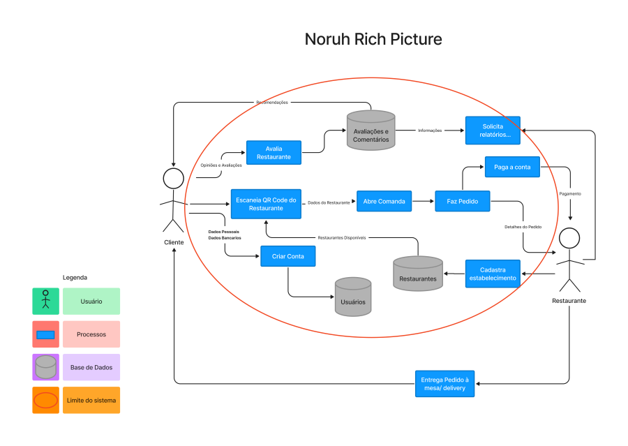

# Rich Picture

## O que é o Rich Picture?
    
&emsp;&emsp;Os rich pictures abaixo são uma ferramenta para analisar problemas e expressar idéias de maneira informal. Ela ajuda a identificar todos os stakeholders, suas preocupações e alguns detalhes da estrutura de sistemas. Com isso, nós começamos com uma versão mais simples do desenho, utilizando apenas papel e caneta, para então começarmos a evoluí-lo.

## Rich Picture aplicativo Noruh
### Versão 1
&emsp;&emsp; A primeira versão da Rich Picture do app Noruh, feita em papel e caneta, pode ser encontrada abaixo:

<figcaption align='center'>
    <b>Figura 1: Versão inicial Rich Picture</b>
     <small>Fonte: Elaboração Própria</small>
</figcaption>

### Versão 2
&emsp;&emsp; A segunda versão da Rich Picture do app Noruh, feita com auxílio da ferramenta Figma, pode ser encontrada abaixo:

<figcaption align='center'>
    <b>Figura 2: Segunda Versão Rich Picture</b>
     <small>Fonte: Elaboração Própria</small>
</figcaption>

## Histórico de Versão

| Versão |                Alteração               | Responsável |         Revisor        |  Data |
|:------:|:--------------------------------------:|:-----------:|:----------------------:|:-----:|
|   1.0  |           Criação de documento                   |    Lucas    | João Henrique e Eurico | 23/06 |
|   1.1  |              Página revisada                |    João Henrique e Eurico    | - | 23/06 |
|   2.0  | Feito no Figma e adicionando processos |    Lucas    |      João Henrique     | 26/06 |
|   2.1  | Página na revisada |    João Henrique    |      -     | 26/06 |
|   2.2  |      Diminuindo limites do sistema     |    Lucas    |      João Henrique     | 30/06 |
|   2.3  |      Adiciona legendas e fontes    |    Lucas    |      João Henrique     | 26/07 |

## Referências
- "Introducing Rich Pictures - Rich Picture Drawing Guidelines" - Software Development Project

- MONK, Andrew; HOWARD, Steve. "The Rich Picture: A Tool for Reasoning About Work Context". 1998